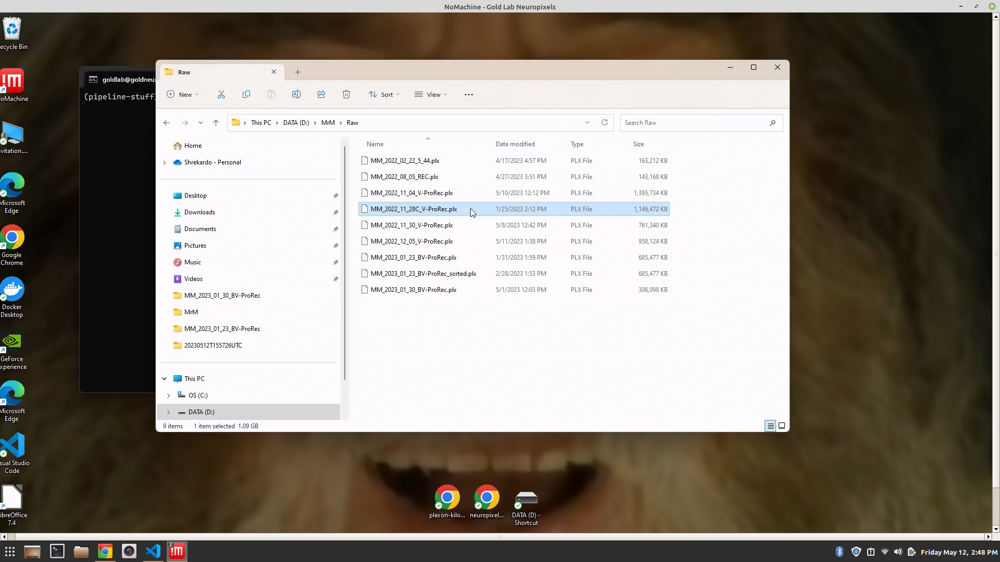
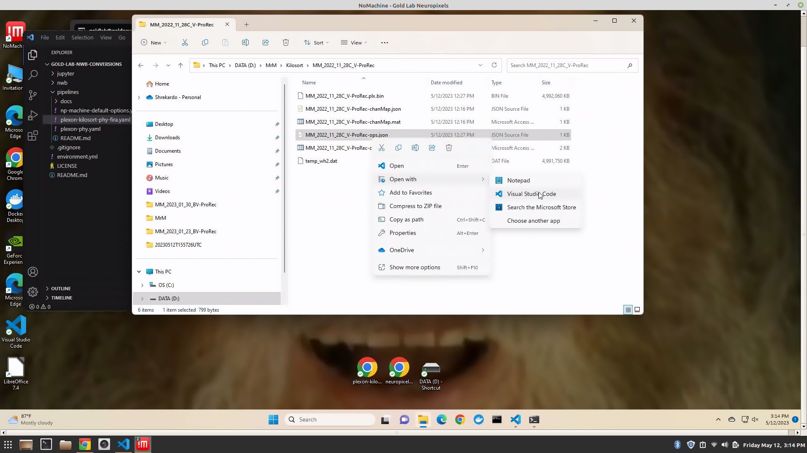
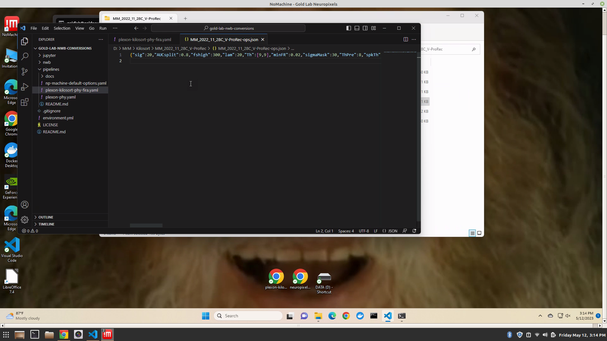
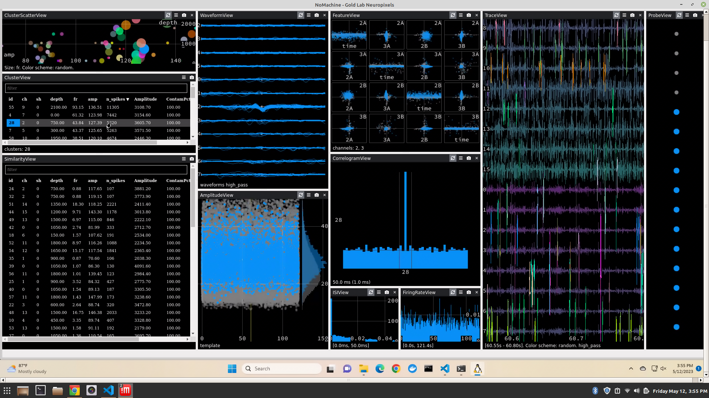
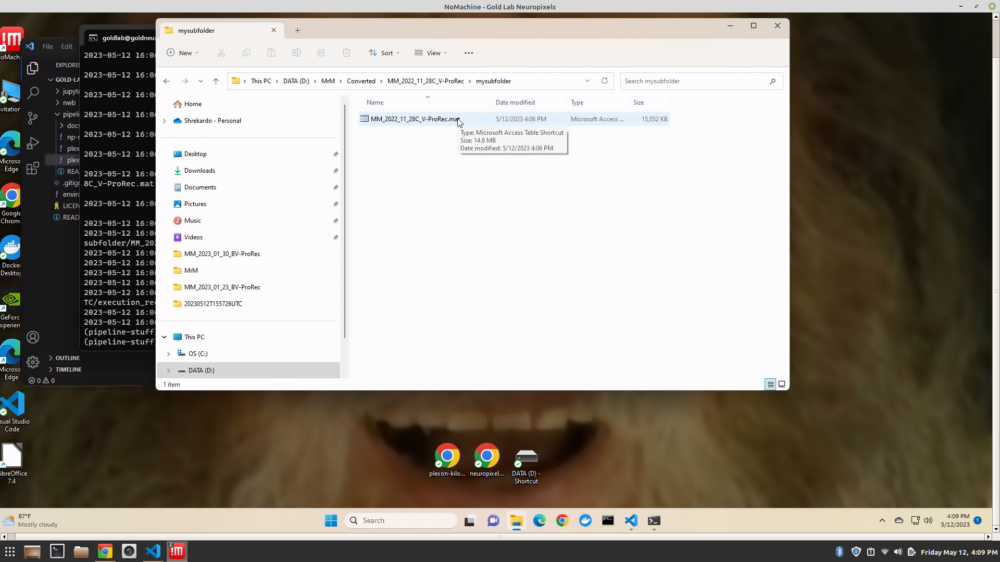

# March-May 2023
Ben Heasly

[benjamin.heasly@gmail.com](mailto:benjamin.heasly@gmail.com)

[https://www.tripledip.info/](https://www.tripledip.info/)


Here's an overview of our new sorting pipeline for Plexon with Kilosort!

This one uses our [Proceed](https://github.com/benjamin-heasly/proceed) tool to run pipelines declared in YAML files.

Hopefully this is preferable to cutting and pasting commands into the terminal, as in our [manual proof of concept pipeline](../manual-poc/README.md).

This document started as a Google Doc [here](https://docs.google.com/document/d/1XrfAMFngeLdG7fOxbnDsMQYHO39rXbhZy_HKfMlxpOw/edit?usp=sharing).
You may or may not have access to that doc.
I [converted it to Markdown](https://workspace.google.com/marketplace/app/docs_to_markdown/700168918607) so we could save it here in [this repo](https://github.com/benjamin-heasly/gold-lab-nwb-conversions).


# Installation

The Proceed repo is at GitHub here: [proceed](https://github.com/benjamin-heasly/proceed)

And the main docs, including installation instructions are here: [proceed docs](https://benjamin-heasly.github.io/proceed/index.html)


## Neuropixels Machine

[Docker](https://docs.docker.com/desktop/install/windows-install/) and Python are already installed on the Gold Lab Neuropixels machine.

[Conda](https://docs.conda.io/projects/conda/en/latest/user-guide/install/linux.html) is also installed, to manage Python environments.

Proceed itself is still evolving pretty quickly, so it makes sense to update it before you use it.

First get into WSL, which is our Ubuntu Linux environment within Windows.  Open the Windows Command Prompt and type `wsl` to enter Linux mode.


```
wsl
```


Run the following to get and install the latest version of Proceed.


```
# Activate our Python environment
conda activate pipeline-stuff

# Get the latest code
cd /mnt/d/repos/proceed
git pull

# Install Proceed from source code, in our Conda environment.
pip install .
```


# Spike Sorting with Kilosort and Phy

Here are some instructions for how you can spike-sort Plexon files with Proceed.


## setup

If you haven't already, go to WSL, activate our Conda environment for running pipelines, and `cd` to our folder that contains pipeline definition YAML files.


```
# Activate our Python environment (if not already)
conda activate pipeline-stuff

# Get the latest pipeline definitions
cd /mnt/d/repos/gold-lab-nwb-conversions
git pull
cd pipelines
```


## initial file conversion step

When sorting a new file, the first step is to convert from Plexon's `.plx` file format to the raw, binary `.bin` format expected by Kilosort.

Find a file you want to sort in a subject's "Raw" folder on the Neuropixels machine, for example `MrM/Raw/MM_2022_11_28C_V-ProRec.plx`.  In this example we're looking in the folder for subject `MrM`.  We can use folders for other subjects, too -- see [other subjects](#other-subjects) below.

From Windows this would look like: `D:\MrM\Raw\MM_2022_11_28C_V-ProRec.plx`



From WSL / Linux this would look like: `/mnt/d/MrM/Raw/MM_2022_11_28C_V-ProRec.plx`

```
$ ls -alth /mnt/d/MrM/Raw/
total 6.0G
drwxrwxrwx 1 goldlab goldlab 4.0K May 11 13:46 .
-rwxrwxrwx 1 goldlab goldlab 936M May 11 13:38 MM_2022_12_05_V-ProRec.plx
-rwxrwxrwx 1 goldlab goldlab 1.4G May 10 12:12 MM_2022_11_04_V-ProRec.plx
-rwxrwxrwx 1 goldlab goldlab 744M May  8 12:42 MM_2022_11_30_V-ProRec.plx
-rwxrwxrwx 1 goldlab goldlab 299M May  1 12:03 MM_2023_01_30_BV-ProRec.plx
-rwxrwxrwx 1 goldlab goldlab 140M Apr 27 15:51 MM_2022_08_05_REC.plx
drwxrwxrwx 1 goldlab goldlab 4.0K Apr 17 17:00 ..
-rwxrwxrwx 1 goldlab goldlab 160M Apr 17 16:57 MM_2022_02_22_5_44.plx
-rwxrwxrwx 1 goldlab goldlab 670M Feb 28 13:53 MM_2023_01_23_BV-ProRec_sorted.plx
-rwxrwxrwx 1 goldlab goldlab 670M Jan 31 13:59 MM_2023_01_23_BV-ProRec.plx
-rwxrwxrwx 1 goldlab goldlab 1.1G Jan 25 14:12 MM_2022_11_28C_V-ProRec.plx <------------
```

Note the base name of your file -- without the ".plx" at the end.  In this example it's `MM_2022_11_28C_V-ProRec`.  You'll need this base name in the steps below.

To convert your file to Kilosort's format you can run the following command using your file base name as the `plx_name` argument.

```
# Convert plx to kilosort
proceed run plexon-kilosort-phy-fira.yaml \
  --local-options-file np-machine-default-options.yaml \
  --step-names plx-to-kilosort \
  --args plx_name=MM_2022_11_28C_V-ProRec
```

**A point about shell command syntax:** the command above is a multi-line shell command where backslashes `\` tell the shell that the same command continues on the next line.  Hopefully this makes the commands easier to read and edit -- just make sure to include backslashes like these, otherwise each line will run as a separate (nonsense) shell command.

After several minutes and lots of logging, this will produce several new files in a `Kilosort` folder and a subfolder named like the Plexon file

From Windows this would look like: `D:\MrM\Kilosort\MM_2022_11_28C_V-ProRec\`.


From WSL / Linux this would look like: `/mnt/d/MrM/Kilosort/MM_2022_11_28C_V-ProRec/`

```
$ ls -alth /mnt/d/MrM/Kilosort/MM_2022_11_28C_V-ProRec/
total 9.6G
drwxrwxrwx 1 goldlab goldlab 4.0K May 12 14:57 .
-rwxrwxrwx 1 goldlab goldlab 4.8G May 12 12:57 temp_wh2.dat
-rwxrwxrwx 1 goldlab goldlab  799 May 12 12:27 MM_2022_11_28C_V-ProRec-ops.json
-rwxrwxrwx 1 goldlab goldlab 1.7K May 12 12:27 MM_2022_11_28C_V-ProRec-ops.mat
-rwxrwxrwx 1 goldlab goldlab 4.8G May 12 12:27 MM_2022_11_28C_V-ProRec.plx.bin
-rwxrwxrwx 1 goldlab goldlab  333 May 12 12:16 MM_2022_11_28C_V-ProRec-chanMap.json
-rwxrwxrwx 1 goldlab goldlab  320 May 12 12:16 MM_2022_11_28C_V-ProRec-chanMap.mat
drwxrwxrwx 1 goldlab goldlab 4.0K May 12 11:07 ..
```

### optional args

By default this will convert only those channels in the `.plx` file that have data on them.  You can convert a specific subset of channels by passing in a value for the `connected` pipeline arg.  This value is an expression passed to Matlab and should results in a logical indexing array for selecting channels out of the full list.  For example, `"[true true false true true false]"` would select the first, second, fourth, and fifth channels out of a full list of six or more channels.

Note: the standard shell and Python argument parsers are sensitive to spaces, so we need the quotes `" ... "` around extended values like this.

Also by default, this will convert the entire recording timeline.  You can convert an explicit subrange by passing in values (in seconds) for the `plx_t_start` and/or `plx_t_end` pipeline args.

Here's an example using explicit channel selection and time range.

```
# Convert plx to kilosort with specific connected channels and time range
proceed run plexon-kilosort-phy-fira.yaml \
  --local-options-file np-machine-default-options.yaml \
  --step-names plx-to-kilosort \
  --args plx_name=MM_2022_11_28C_V-ProRec plx_t_start=120 plx_t_end=240 connected="[true true false true true false]"
```


### overwriting a previous run

By default, the conversion step will only run once.  Once the output files exist the pipeline will skip the conversion step to avoid extra time and work.  You can force the pipeline to re-run the conversion step anyway, by passing a `--force-rerun` flag.

```
# Convert plx to kilosort, overwriting an existing conversion
proceed run plexon-kilosort-phy-fira.yaml \
  --local-options-file np-machine-default-options.yaml \
  --step-names plx-to-kilosort \
  --args plx_name=MM_2022_11_28C_V-ProRec plx_t_start=120 plx_t_end=240 connected="[true true false true true false]" \
  --force-rerun
```

***A point about small numbers of channels:*** by default Kilosort 3 is hard-coded to work with 10 or more channels, and errors out with fewer than 10.  We [patched the code](https://github.com/benjamin-heasly/Kilosort/pulls?q=is%3Apr+is%3Aclosed) to remove this known limit, and now we can go down to 4 channels.  4 seems to be a harder limit, going deeper into the Kilosort 3 implementation, and not so easy to patch (and also riskier to mess with).  For now, let's just try to include 4 or more channels.

### other subjects

The example above has been using the Plexon file `MM_2022_11_28C_V-ProRec.plx`, located in the folder for subject `MrM`: `MrM/Raw/MM_2022_11_28C_V-ProRec.plx`.  If your Plexon file belongs to a different subject, you can specify the subject's folder by passing a value for the `data_dir` pipeline arg.

The pipeline will expect a consistent subfolder layout within each subject's folder.  For example, each subject folder must contain a `Raw` subfolder with existing Plexon files.

Here's an example for sorting a made up Plexon file `JP_1701_D.plx`, located in a folder for subject `JLP`: `JLP/Raw/JP_1701_D.plx`.

```
# Convert plx to kilosort for a subject other than MrM
proceed run plexon-kilosort-phy-fira.yaml \
  --local-options-file np-machine-default-options.yaml \
  --step-names plx-to-kilosort \
  --args plx_name=JP_1701_D data_dir=/mnt/d/JLP
```

You should include same `data_dir` when running the steps below.

## review and edit ops

In addition to the raw `.bin` file, the conversion step will produce a .`json` file of Kilosort ops that you can review and edit.

Some of these default ops are copied from Kilosort examples and hard-coded into our conversion code [here](https://github.com/benjamin-heasly/plx-to-kilosort/blob/main/plx-to-kilosort/matlab/defaultOpsForPlxFile.m).  

Some of the ops, like `NchanTOT` and `trange`, depend on the original Plexon file and the optional pipeline `args` mentoined above, like `connected`, `plx_t_start`, and `plx_t_end`.

You might want to review and edit some of these values, before proceeding with the spike sorting steps.





## sorting steps: Kilosort and Phy

After you convert your Plexon file to Kilosort's binary format, you can run Kilosort and view the sorting results in the Phy GUI.  You can do this using the same pipeline as before, but this time we'll tell the pipeline runner to run the whole pipeline instead of just the conversion step.  The runner will find that the conversion step is already complete, skip it, and proceed to spike sorting.

From spike sorting onwards, it can be useful to pass in a `results_name` arg.  This tells the runner to store spike sorting and downstream results in a subfolder, using the given name.  This way, results of multiple runs won't clobber each other.

```
# Continue the pipeline and sort some spikes
proceed run plexon-kilosort-phy-fira.yaml \
  --local-options-file np-machine-default-options.yaml \
  --args plx_name=MM_2022_11_28C_V-ProRec results_name=mysubfolder
```

After several minutes of sorting, the pipeline should automatically open the Phy GUI for an interactive session.



I don't know if having an interactive step is a good or bad idea -- just something we can try!

## final step: creating a FIRA struct

While the Phy GUI is open, the pipeline runner is actually still running.  Once you close the GUI, the runner will proceed to the final step of combining Plexon and Phy results to gether into a Gold Lab `FIRA` struct and `.mat` file for further analysis.

From Windows, this would look like: `D:\MrM\Converted\MM_2022_11_28C_V-ProRec\mysubfolder\MM_2022_11_28C_V-ProRec.mat`.



From WSL / Linux this would look like: `/mnt/d/MrM/Converted/MM_2022_11_28C_V-ProRec/mysubfolder/MM_2022_11_28C_V-ProRec.mat`

```
$ ls -alth /mnt/d/MrM/Converted/MM_2022_11_28C_V-ProRec/mysubfolder/
total 15M
-rwxrwxrwx 1 goldlab goldlab  15M May 12 16:06 MM_2022_11_28C_V-ProRec.mat
drwxrwxrwx 1 goldlab goldlab 4.0K May 12 16:06 .
drwxrwxrwx 1 goldlab goldlab 4.0K May 12 15:55 ..
```


## revisiting results later on: Phy

In case you come back later to view previous sorting results, you can re-run the whole pipeline as in the previous command.  The pipeline runner should skip the first steps that are already completed and jump to the interactive Phy GUI step.

You can also run the Phy GUI step explicitly, by name.

```
# Re-run the Phy GUI step
proceed run plexon-kilosort-phy-fira.yaml \
  --local-options-file np-machine-default-options.yaml \
  --args plx_name=MM_2022_11_28C_V-ProRec results_name=mysubfolder \
  --step-names "phy template-gui"
```

# Viewing Plexon Manual Sorting with Phy

We also have a shorter pipeline to convert manually sorted Plexon data to Phy for visualization there.  To launch this, you can run the following command in WSL.

```
proceed run plexon-phy.yaml \
  --local-options-file np-machine-default-options.yaml \
  --args plx_name=MM_2022_08_05_REC
```

This will take several minutes to run and should end with an interactive Phy session.

Note: this uses a different pipeline definition YAML file: `plexon-phy.yaml` as opposed to `plexon-kilosort-phy-fira.yaml`.

Also note: I'm using a different, smaller raw Plexon file in this example, `MM_2022_08_05_REC` as opposed to `MM_2022_11_28C_V-ProRec`.  I don't know if this step is robust to all our files, but this example works OK!

# Summarizing Pipeline Runs

Proceed can also summarize previous pipeline runs into a csv / spreadsheet.  To summarize everything many previous runs on the neuropixels machine so far, you can run the following in WSL:

```
# Activate our Python environment (if not already)
conda activate pipeline-stuff

cd /mnt/d/
proceed summarize
```

By default this will look for execution results in `/mnt/d/proceed_out` and produce a summary at `summary.csv`. You can specify an alternate output file using proceed `summarize --summary-file some_other.csv`.

It should be possible to view the `.csv`s with Excel, Google Sheets, and/or Libreoffice Calc.

I think this may turn out to be useful, but we haven't explored it much, yet.
