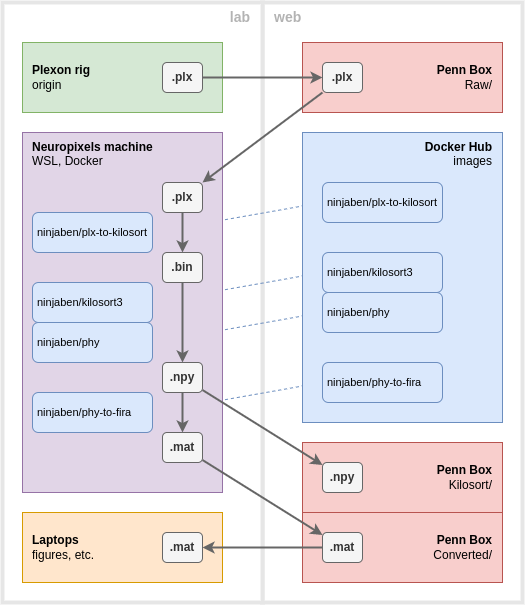

# January-March 2023
Ben Heasly

[benjamin.heasly@gmail.com](mailto:benjamin.heasly@gmail.com)

[https://www.tripledip.info/](https://www.tripledip.info/)

Here's an overview of our initial spike sorting pipeline for Plexon with Kilosort!

Hopefully this doc will work as a practical guide to getting up and running.  I'll include some discussion of what's happening in the steps, but I'll try to keep it short.

This document started as a Google Doc [here](https://docs.google.com/document/d/1hTHt1gZ8NKenOPPF1nBr4-3LroORT7FXVLTEzPcLjT8/edit?usp=sharing).
You may or may not have access to that doc.
I [converted it to Markdown](https://workspace.google.com/marketplace/app/docs_to_markdown/700168918607) so we could save it here in [this repo](https://github.com/benjamin-heasly/gold-lab-nwb-conversions).


# Visual Overview



The pipeline steps mostly run in the **lab** (left side) -- on the Plexon rig where data are originally recorded, on the Neuropixels machine that has a NVIDIA GPU for processing power, and on laptops / workstations of lab members for analysis.

The pipeline also uses tools on the **web** (right side).  The lab's [Penn Box account](https://upenn.box.com/s/zqmly6l1t9xfd492md2kkdylel6cwolh) stores raw and processed data files and helps transfer them between machines.  The public [Docker Hub](https://hub.docker.com/) registry hosts Docker images that implement processing steps.


# Pipeline Steps

Here are short descriptions of the steps that make up the pipeline.


## Plexon rig -- origin

Everything starts on a Plexon rig.  During an electrophysiology recording session, Plexon creates a raw data file called the `.plx` file.  This file contains raw waveforms from recorded neural channels.  These are the waveforms we want to spike-sort.


## Penn Box -- `Raw/`

The lab has a convention for storing the raw .plx files on Penn Box, in a `Raw/` subfolder for a particular experiment and monkey.  Penn Box helps archive the data and also makes it available to other machines.

Hopefully we can configure a Penn Box client on the Neuropixels machine to automatically list new raw data files in the Windows file system and allow the pipeline to access them.


## Neuropixels machine

This machine runs the bulk of the pipeline.  It sits in Josh's office and we connect to it using [NoMachine](https://www.nomachine.com/).

We need to use this machine because it has an [NVIDIA graphics card](https://www.nvidia.com/en-us/geforce/graphics-cards/30-series/rtx-3070-3070ti/) which is required for the [Kilosort](https://github.com/MouseLand/Kilosort) spike sorter we're using.  Sorting with the GPU makes things run in a reasonable amount of time.

The Neuropixels machine is a Windows 11 machine.  Windows 11 has a feature called WSL ([Windows Subsystem for Linux](https://learn.microsoft.com/en-us/windows/wsl/install)) which allows us to run Linux and [Docker](https://www.ibm.com/topics/docker) alongside Windows itself, all at the same time.  We take advantage of all this by implementing our pipeline processing steps using Docker.  This eliminates a lot of machine-specific config and debugging.

Each processing step on this machine corresponds to a different Docker "image".  A Docker image is an exact definition of the environment in which a process will run, including installed software and system configuration.

For each step we "pull" the image we want from Docker Hub, which is a public registry of Docker images, onto the Neuropixels machine.  Then we run a process inside the environment that the image defines.  This running process, contained within the image environment, is called a Docker "container".

Here are the images we pull / containers we run, and what they do for us at each step.


### Raw data conversion: ninjaben/plx-to-kilosort

This image is on Docker Hub at [ninjaben/plx-to-kilosort](https://hub.docker.com/repository/docker/ninjaben/plx-to-kilosort/general).

The source code that created the image is on GitHub at [benjamin-heasly/plx-to-kilosort](https://github.com/benjamin-heasly/plx-to-kilosort).

This includes Matlab code that runs inside the container.

Inputs:

* raw `.plx` file from recording, eg `D:\MrM\Raw\MM_2022_11_28C_V-ProRec.plx`

Outputs:


* raw `.bin` file Kilosort can read, eg `D:\MrM\Kilosort\MM_2022_11_28C_V-ProRec.plx.bin`
* Kilosort channel map, eg `D:\MrM\Kilosort\MM_2022_11_28C_V-ProRec-chanMap.mat`
* Kilosort ops struct, eg `D:\MrM\Kilosort\MM_2022_11_28C_V-ProRec-ops.mat`

To Run this step on the Neuropixels machine, open the Windows Command Prompt and type `wsl` to enter Linux mode.


```
wsl
```


Then copy and paste the following long command into the Linux command prompt.


```
docker run \
  --rm \
  --mac-address "68:f7:28:f6:68:a6" \
  --env="MLM_LICENSE_FILE=/licenses/license.lic" \
  --volume="/mnt/d/matlabLicense/license.lic:/licenses/license.lic" \
  --volume="/mnt/d/MrM:/MrM" \
  ninjaben/plx-to-kilosort:v0.0.15 \
  -batch "plxToKilosort('/MrM/Raw/MM_2022_11_28C_V-ProRec.plx', '/MrM/Kilosort', 'chanY', [1050, 900, 750, 600, 450, 300, 150, 0, 2250, 2100, 1950, 1800, 1650, 1500, 1350, 1200], 'interpolate', true)"
```


There's a lot going on there, let's unpack it a bit:


* `docker run` means we're starting a container process.
* `--rm` means Docker should delete the container environment when it's done running.
* `--mac-address "..."`, `--env="..."`, and the first `--volume="..."` are all used to tell Matlab inside the container which license file to use. 
* `--volume="/mnt/d/MrM:/MrM"` means mount the "MrM" folder on the Windows `D:\` drive inside the container so it can access the data.
* `ninjaben/plx-to-kilosort:v0.0.15` means the container environment will come from version `0.0.8` of this `ninjaben/plx-to-kilosort` Docker image.
* `-batch "..."` tells Matlab to run a single command then exit.  The command is to convert a given `.plx` file, write results into a `Kilosort/` subfolder, and record the fact that the electrode used in the Plexon recording had 16 contacts in a line, 150μm apart, arranged out of order as in the tables below


#### Probe Layout -- TODO is this correct?

with microns in order


<table>
  <tr>
   <td>8
   </td>
   <td>7
   </td>
   <td>6
   </td>
   <td>5
   </td>
   <td>4
   </td>
   <td>3
   </td>
   <td>2
   </td>
   <td>1
   </td>
   <td>16
   </td>
   <td>15
   </td>
   <td>14
   </td>
   <td>13
   </td>
   <td>12
   </td>
   <td>11
   </td>
   <td>10
   </td>
   <td>9
   </td>
  </tr>
  <tr>
   <td>0
   </td>
   <td>150
   </td>
   <td>300
   </td>
   <td>450
   </td>
   <td>600
   </td>
   <td>750
   </td>
   <td>900
   </td>
   <td>1050
   </td>
   <td>1200
   </td>
   <td>1350
   </td>
   <td>1500
   </td>
   <td>1650
   </td>
   <td>1800
   </td>
   <td>1950
   </td>
   <td>2100
   </td>
   <td>2250
   </td>
  </tr>
</table>


with channel numbers in order


<table>
  <tr>
   <td>1
   </td>
   <td>2
   </td>
   <td>3
   </td>
   <td>4
   </td>
   <td>5
   </td>
   <td>6
   </td>
   <td>7
   </td>
   <td>8
   </td>
   <td>9
   </td>
   <td>10
   </td>
   <td>11
   </td>
   <td>12
   </td>
   <td>13
   </td>
   <td>14
   </td>
   <td>15
   </td>
   <td>16
   </td>
  </tr>
  <tr>
   <td>1050
   </td>
   <td>900
   </td>
   <td>750
   </td>
   <td>600
   </td>
   <td>450
   </td>
   <td>300
   </td>
   <td>150
   </td>
   <td>0
   </td>
   <td>2250
   </td>
   <td>2100
   </td>
   <td>1950
   </td>
   <td>1800
   </td>
   <td>1650
   </td>
   <td>1500
   </td>
   <td>1350
   </td>
   <td>1200
   </td>
  </tr>
</table>


```
chanY = [1050, 900, 750, 600, 450, 300, 150, 0, 2250, 2100, 1950, 1800, 1650, 1500, 1350, 1200];
```


Output from a good run should end something like this:


```
plxToKilosort Writing Kilosort ops to /MrM/Kilosort/ops.mat.
plxToKilosort Finish at: 20230125T194450 (00:15:19 elapsed)
```


### Spike sorting: ninjaben/kilosort3

This image is on Docker Hub at [ninjaben/kilosort3](https://hub.docker.com/repository/docker/ninjaben/kilosort3/general).

The source code that created the image is on GitHub at [benjamin-heasly/kilosort3-docker](https://github.com/benjamin-heasly/kilosort3-docker).

This includes Matlab code that runs inside the container.

Inputs:

* raw `.bin` file, eg `D:\MrM\Kilosort\MM_2022_11_28C_V-ProRec.plx.bin`
* Kilosort channel map, eg `D:\MrM\Kilosort\MM_2022_11_28C_V-ProRec-chanMap.mat`
* Kilosort ops struct, eg `D:\MrM\Kilosort\MM_2022_11_28C_V-ProRec-ops.mat`
* Editable ops overrides file, eg  `D:\MrM\Kilosort\MM_2022_11_28C_V-ProRec-ops.json`

Note: you can edit `D:\MrM\Kilosort\MM_2022_11_28C_V-ProRec-ops.json`, and fields you add or change here will override fields in the default Kilosort `ops` `.mat` file.  This allows you to adjust Kilosort's parameters and re-run.  In particular, you might want to change the start time or end time for kilosort to work on (in seconds).

Outputs:


* Kilosort results data struct called  "rez", eg `D:\MrM\Kilosort\MM_2022_11_28C_V-ProRec-results\rez.mat`
* Python` params.py` and `.npy` files in a folder eg `D:\MrM\Kilosort\MM_2022_11_28C_V-ProRec-results\phy`

To run this step, copy and paste the following long command into the Linux command prompt.


```
docker run \
  --rm \
  --gpus all \
  --mac-address "68:f7:28:f6:68:a6" \
  --env="MLM_LICENSE_FILE=/licenses/license.lic" \
  --volume="/mnt/d/matlabLicense/license.lic:/licenses/license.lic" \
  --volume="/mnt/d/MrM:/MrM" \
  ninjaben/kilosort3:v0.0.25 \
  -batch "runKilosort('/MrM/Kilosort/MM_2022_11_28C_V-ProRec-ops.mat', '/MrM/Kilosort/MM_2022_11_28C_V-ProRec-results', 'ops', '/MrM/Kilosort/MM_2022_11_28C_V-ProRec-ops.json, 'driftCorrection', false, 'autoMerge', false)"
```


This `docker run` command is much like the one in the previous step.  One key addition is:


* `--gpus all` tells Docker to connect the NVIDIA GPU drivers to the running container.

 

Output from a good run should end something like this:


```
runKilosort Finished kilosort run.
runKilosort Writing phy files to /MrM/Kilosort/MM_2022_11_28C_V-ProRec-results/phy:
runKilosort Finish at: 20230125T205223 (00:09:15 elapsed)
```


### Spike cluster curation: ninjaben/phy

This image is on Docker Hub at [ninjaben/phy](https://hub.docker.com/repository/docker/ninjaben/phy/general).

The source code that created the image is on GitHub at [benjamin-heasly/kilosort3-docker](https://github.com/benjamin-heasly/kilosort3-docker).

This includes Python [phy](https://github.com/cortex-lab/phy) code that runs an interactive graphical application.

Inputs:


* raw `.bin` file, eg `D:\MrM\Kilosort\MM_2022_11_28C_V-ProRec.plx.bin`
* Python `params.py` and `.npy` files in a folder eg `D:\MrM\Kilosort\MM_2022_11_28C_V-ProRec-results\phy`

Outputs:


* modifies input Python `params.py` and `.npy` files

This step takes two commands.


#### First: extract-waveforms

The first command uses phy to extract viewable features from the raw waveform data.  This is a workaround for a known issue with Kilosort 3 and how it integrates with phy (see [phy 1071](https://github.com/cortex-lab/phy/issues/1071), [Kilosort 317](https://github.com/MouseLand/Kilosort/issues/317), [Kilosort 429](https://github.com/MouseLand/Kilosort/issues/429)).  Hopefully this will be resolved "soon ish" and then this first command can go away.

To extract the viewable waveforms, copy and paste the following long command into the Linux command prompt.


```
docker run \
  --rm \
  --volume="/mnt/d/MrM:/MrM" \
  ninjaben/phy:v0.0.25 \
  phy extract-waveforms /MrM/Kilosort/MM_2022_11_28C_V-ProRec-results/phy/params.py
```


Since this is Python, we no longer need to pass in Matlab license information, just the data folder.

This first command should run for a few minutes or less.  Output from a good run should end something like this:


```
Extracting waveforms: 100%|██████████| 3993.4/3993.4 [01:33<00:00, 42.90it/s]
```


#### Second: template-gui

The second command lets you interactively review and "curate" spike sorting results.  Copy and paste the following long command into the Linux command prompt.


```
docker run \
  --rm \
  --gpus all \
  --env="DISPLAY" \
  --vome="/tmp/.X11-unix:/tmp/.X11-unix:rw" \
  --volume="/mnt/d/MrM:/MrM" \
  ninjaben/phy:v0.0.25 \
  phy template-gui /MrM/Kilosort/MM_2022_11_28C_V-ProRec-results/phy/params.py
```


Since phy is an interactive graphical app, we need to pass in X11 display resources.


* `--env="DISPLAY"` and the first `--volume="..."` allow the container to use an interactive graphical window.

This command should cause a new window to open, with lots of data to visualize and interact with.  When done, close the window and the docker command should finish automatically.


### Sorted data conversion: ninjaben/phy-to-fira

This image is on Docker Hub at [ninjaben/phy-to-fira](https://hub.docker.com/repository/docker/ninjaben/phy-to-fira/general).

The source code that created the image is on GitHub at [benjamin-heasly/phy-to-fira](https://github.com/benjamin-heasly/phy-to-fira).

This includes Matlab code that runs inside the container.

Inputs:


* Phy `params.py`, with `.npy` and `.tsv` files in the same folder eg `D:\MrM\Kilosort\MM_2022_11_28C_V-ProRec-results\phy\params.py`
* raw `.plx` file from recording, eg `D:\MrM\Raw\MM_2022_11_28C_V-ProRec.plx`
* FIRA "spm" file with helper functions in the same folder, eg `D:\MrM\Spm\spmADPODR5.m`

Outputs:


* FIRA struct saved to `.mat` file, eg `D:\MrM\Converted\MM_2022_11_28C_V-ProRec.mat`

To run the FIRA conversion and trial parsing, paste this long command into the Linux command prompt:


```
docker run \
  --rm \
  --mac-address "68:f7:28:f6:68:a6" \
  --env="MLM_LICENSE_FILE=/licenses/license.lic" \
  --volume="/mnt/d/matlabLicense/license.lic:/licenses/license.lic" \
  --volume="/mnt/d/MrM:/MrM" \
  ninjaben/phy-to-fira:v0.0.2 \
  -batch "convertedFile = phyToFira('/MrM/Kilosort/MM_2022_11_28C_V-ProRec-results/phy/params.py', '/MrM/Raw/MM_2022_11_28C_V-ProRec.plx', '/MrM/Spm/spmADPODR5.m', '/MrM/Converted', 'spike_list', [zeros([1000, 1]), (0:999)'], 'sig_list', 49:51)"
```


This will merge task and behavioral data from the raw `.plx` file with spike sorting results from Kilosort and Phy.  It will parse all the data into a trial-by-trial format for analysis.


## Penn Box -- `Kilosort/`

Since the Kilosort pipeline and files will be new, we might add to the lab's data storage convention with a "Kilosort" subfolder that holds data for Kilosort and phy.

Hopefully we can configure a Penn Box client on the Neuropixels machine to automatically sync files produced during the Kilosort and phy steps, up to storage on the web.


## Penn Box -- `Converted/`

Once we run the phy-to-fira step, we should be back in familiar territory for lab analysis code.  So, we should be able to put the `.mat` files produced here into the familiar "Converted" subfolder.

Hopefully we can configure a Penn Box client on the Neuropixels machine to automatically sync files produced during the phy-to-fira step, up to storage on the web.


## Laptops

After all the processing on the Neuropixels machine, we should end up with FIRA `.mat` files in the lab's Penn Box.  This is the end of the pipeline.

From here it should be possible to obtain the converted, sorted, smaller (!) FIRA data files and run analyses on any convenient laptop, workstation, etc.

Here's an example script, [reviewSorting.m](reviewSorting.m), which loads and plots data from several of the steps above:


* Kilosort's "rez" struct with raw spike sorting output
* Phy's various Numpy and other files from Kilosort and/or manual curation
* The Gold Lab's FIRA struct that includes trial and behavioral data in addition to the spikes


# Aside -- Compare to Manual Sorting Results

Aside from the main pipeline above, we can also view manual Plexon spike sorting results with the same Phy tool that we used above for Kilosort results.  Hopefully Phy gives us a handy way to do apples-to-apples comparison between the two.


### Manual sorting curation: ninjaben/plx-to-phy

This image is on Docker Hub at [ninjaben/plx-to-phy](https://hub.docker.com/repository/docker/ninjaben/plx-to-phy/general).

The source code that created the image is on GitHub at [benjamin-heasly/plx-to-kilosort](https://github.com/benjamin-heasly/plx-to-kilosort).

This includes [spikeinterface](https://spikeinterface.readthedocs.io/en/latest/) utilities to load and convert recording and spike sorting data between formats.

This also includes a [Jupyter notebook](https://github.com/benjamin-heasly/plx-to-kilosort/blob/main/plx-to-phy/plx_to_phy.ipynb) with code for our specific situation.  This can run interactively like most notebooks, but here we'll run it in non-interactive batch mode just to generate the files we need for Phy.

Inputs:


* raw `.plx` file from recording, eg `D:\MrM\Raw\MM_2022_11_28C_V-ProRec.plx`
* raw `.bin` file, eg `D:\MrM\Kilosort\MM_2022_11_28C_V-ProRec.plx.bin`
* Kilosort ops JSON files, eg `D:\MrM\Kilosort\MM_2022_11_28C_V-ProRec-ops.json`

Outputs:


* Python `params.py` and `.npy` files in a folder eg `D:\MrM\Manual\phy`

To run the Phy conversion, paste this long command into the Linux command prompt:


```
docker run \
  --rm \
  --volume="/mnt/d/MrM:/MrM" \
  --env PLX_FILE="/MrM/Raw/MM_2022_11_28C_V-ProRec.plx" \
  --env BIN_FILE="/MrM/Kilosort/MM_2022_11_28C_V-ProRec.plx.bin" \
  --env OPS_FILE="/MrM/Kilosort/MM_2022_11_28C_V-ProRec-ops.json" \
  --env OUT_DIR="/MrM/Manual" \
  ninjaben/plx-to-phy:v0.0.17 \
  jupyter nbconvert --execute /home/jupyter/notebooks/plx_to_phy.ipynb --to html
```


This will read original, manual spike sorting results from the original `.plx` recording file and combine this with raw waveform data in the raw `.bin` file we created earlier.  Using these it will extract sorted cluster, waveform, and PCA data that we can view in Phy.

The notebook used in this step, [plx_to_phy.ipynb](https://github.com/benjamin-heasly/plx-to-kilosort/blob/main/plx-to-phy/plx_to_phy.ipynb), attempts to choose the data for Phy in a way that's comparable to how Kilosort chooses its data for Phy.  It extracts 82 samples of waveform data around each spike, since Kilosort uses spike templates that are 82 samples wide.  At 40,000Hz this corresponds to +/- 1.025ms.  It also extracts waveforms for all channels instead of using the spikeinterface's "sparse" extraction optimization.

We can then view the results in Phy, similar to how we viewed the Kilosort results.

The second command lets you interactively review and "curate" spike sorting results.  Copy and paste the following long command into the Linux command prompt.


```
docker run \
  --rm \
  --gpus all \
  --env="DISPLAY" \
  --volume="/tmp/.X11-unix:/tmp/.X11-unix:rw" \
  --volume="/mnt/d/MrM:/MrM" \
  ninjaben/phy:v0.0.25 \
  phy template-gui /MrM/Manual/phy/params.py
```
