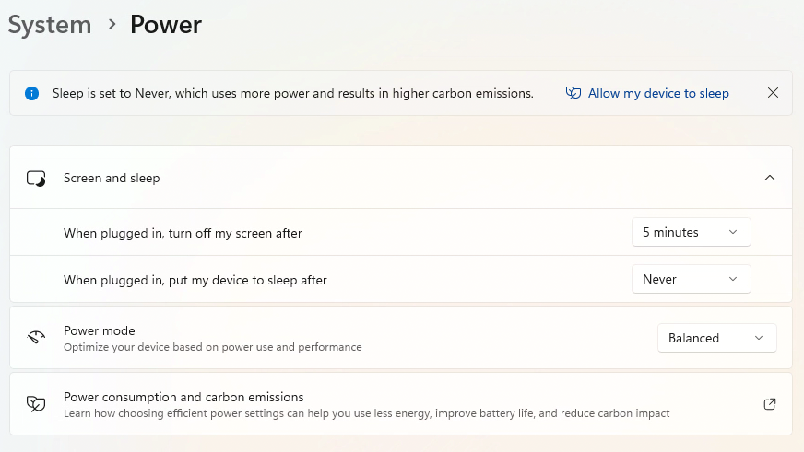
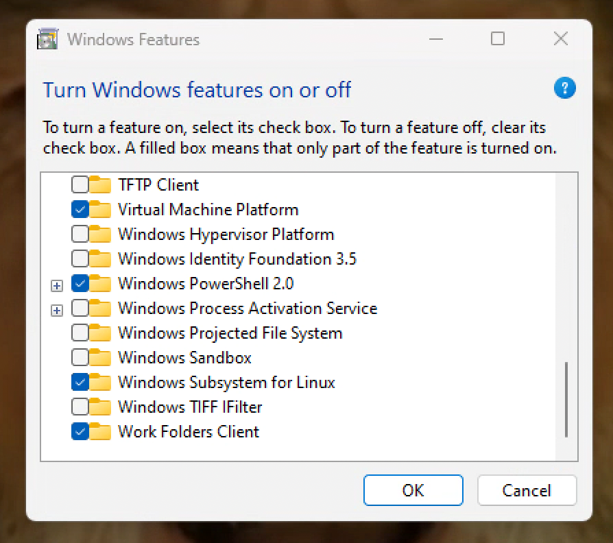
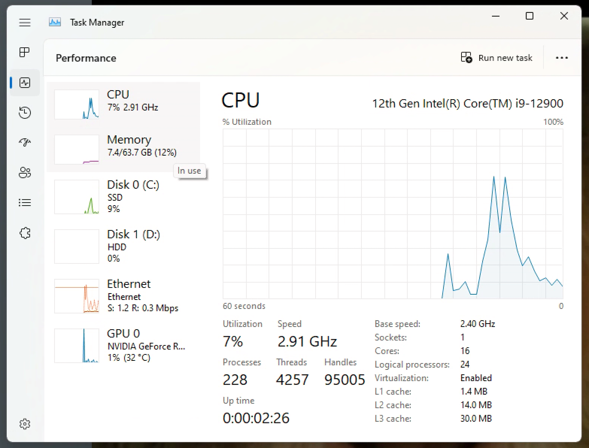
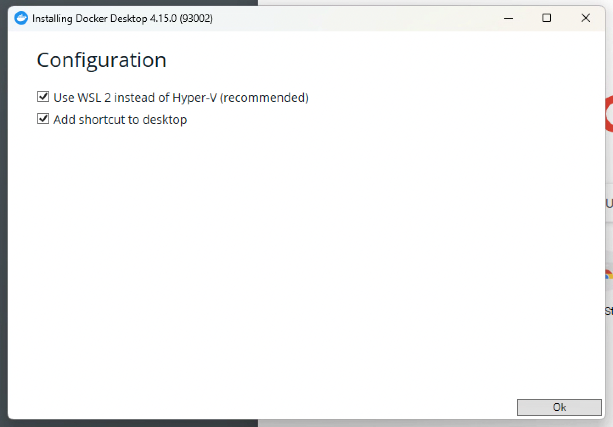
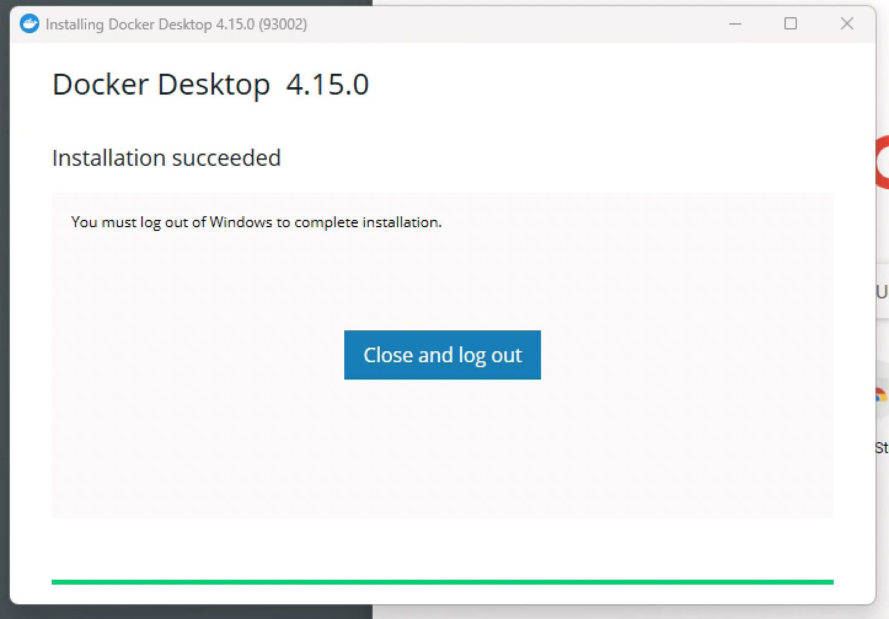
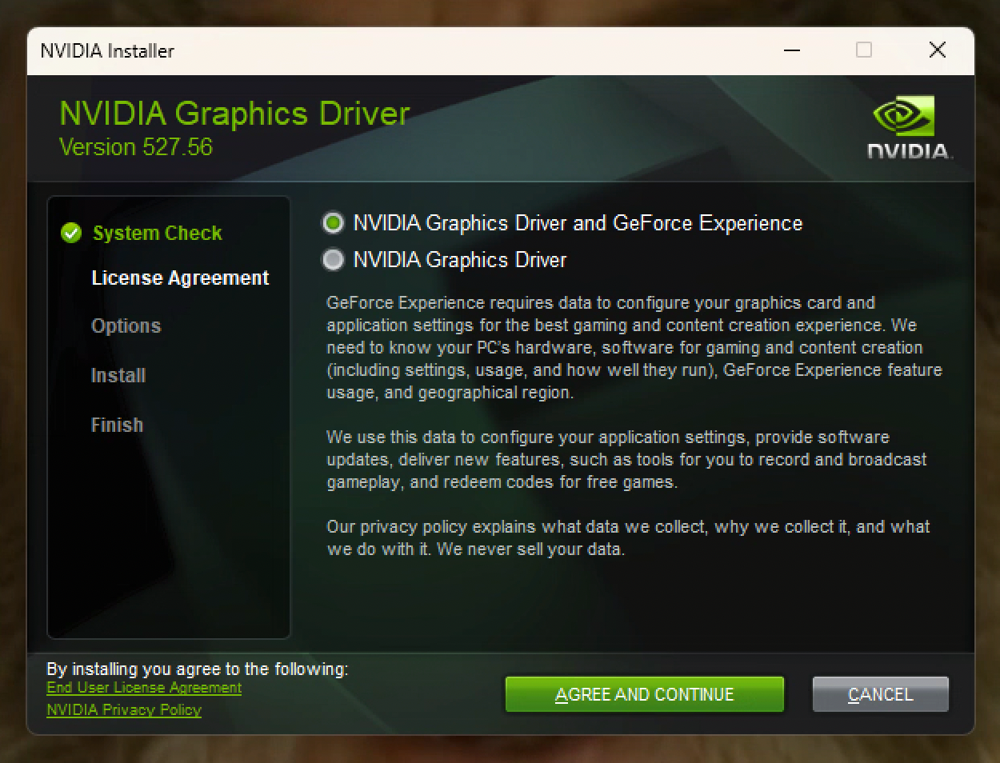
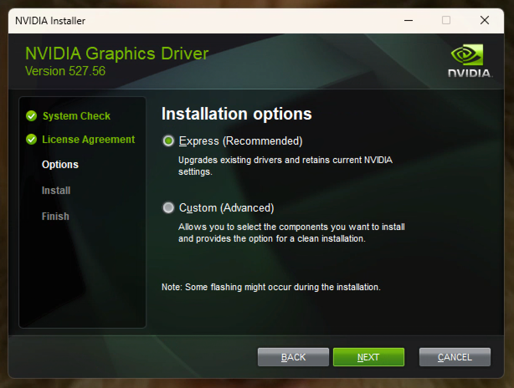
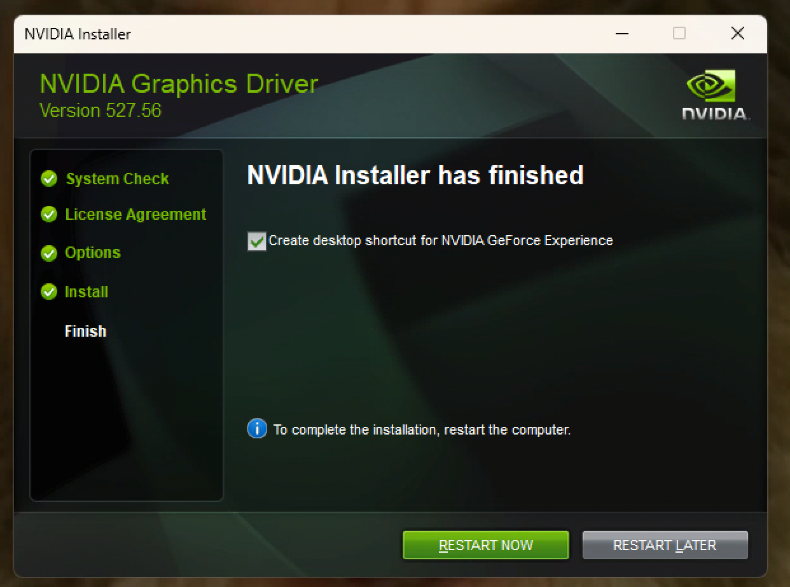
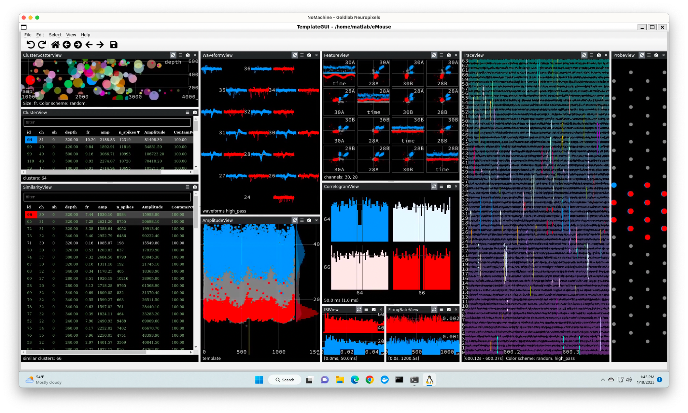

# January 2023
Ben Heasly

[benjamin.heasly@gmail.com](mailto:benjamin.heasly@gmail.com)

[https://www.tripledip.info/](https://www.tripledip.info/)

Here are notes for how I set up the Gold Lab Windows 11 Neuropixels / SpikeGLX / Kilosort machine that has an NVIDIA GeForce graphics card.

The goals of this setup were to:

* Install the latest Windows NVIDIA drivers.
* Set up WSL 2, the "Windows Subsystem for Linux".
* Overall setup so we can run Linux Docker containers on this machine.
* Set up to run NVDIA CUDA-accelerated containers.
* Set up to run Matlab containers.
* Set up to run Matlab containers with gpu-accelerated mex functions. 
* Test the end-to-end setup by running a Kilosort eMouse example in a container

I'm intending this doc to be pretty thorough, like an admin / maintenance log for our future selves or another admin.

This document started as a Google Doc [here](https://docs.google.com/document/d/1pxmAKvQpzpEvrwHSOylFom-d8hLzCnr4P2JAx0bpDEE/edit?usp=sharing).
You may or may not have access to that doc.
I [converted it to Markdown](https://workspace.google.com/marketplace/app/docs_to_markdown/700168918607) so we could save it here in [this repo](https://github.com/benjamin-heasly/gold-lab-nwb-conversions).

# Connection

I'm connecting to the Gold Lab Neuropixels Windows 11 machine that has NVIDIA hardware.


```
165.123.12.37
goldneuropixels.mail.med.upenn.edu
user: GoldLab
password: ***
```


We installed [Nomachine Enterprise Desktop](https://www.nomachine.com/product&p=NoMachine%20Enterprise%20Desktop) to enable the remote connection.

This uses port 4000, which is apparently open at Penn.

We were not able to use the Windows Remote Desktop, on port 3389, because of Penn router configuration.


# System Info

Here's some system info that seems relevant.


```
OS Name	Microsoft Windows 11 Pro
Version	10.0.22621 Build 22621
Other OS Description 	Not Available
OS Manufacturer	Microsoft Corporation
System Name	GOLDNEUROPIXELS
System Manufacturer	Dell Inc.
System Model	XPS 8950
System Type	x64-based PC
System SKU	0AAC
Processor	12th Gen Intel(R) Core(TM) i9-12900, 2400 Mhz, 16 Core(s), 24 Logical Processor(s)
Installed Physical Memory (RAM)	64.0 GB

Name	NVIDIA GeForce RTX 3070
Adapter Type	NVIDIA GeForce RTX 3070, NVIDIA compatible
Adapter Description	NVIDIA GeForce RTX 3070
Adapter RAM	(1,048,576) bytes
Installed Drivers	
Driver Version	30.0.15.1277
Color Planes	Not Available
Color Table Entries	4294967296
Resolution	1920 x 1080 x 60 hertz
```


This card has "Ampere" architecture, from [here](https://www.nvidia.com/en-ph/geforce/graphics-cards/30-series/rtx-3070-3070ti/).


```
"The GeForce RTXTM 3070 Ti and RTX 3070 graphics cards are powered by Ampere—NVIDIA's 2nd gen RTX architecture"
```


# Chrome

I installed Chrome to use instead of the default Edge browser, from [here](https://www.google.com/chrome/thank-you.html?brand=CHBF&statcb=1&installdataindex=empty&defaultbrowser=0).


# Gandalf

I set a sweet desktop background from [here](https://steamuserimages-a.akamaihd.net/ugc/246962430133837220/2156B23860B197223E354FA54CAC369EFF5398AB/?imw=5000&imh=5000&ima=fit&impolicy=Letterbox&imcolor=#000000&letterbox=false).


# Timezone

Changed time zone from `US Pacific` to `US East`.


# Never Sleep

I set the machine to Never Sleep.

This should allow me to reconnect to the machine each day, after breaks, etc.



There might be a way to enable wakeup from the network, but I don't feel like messing with the BIOS now.


# WSL2 Info

I read about the Windows Subsystem for Linux [here](https://en.wikipedia.org/wiki/Windows_Subsystem_for_Linux).

This is part of how we'll run GPU-accelerated Linux containers on the Windows host.

WSL2 runs a full linux kernel on a managed VM, as opposed to being a system call compatibility layer like WSL1 was.


```
"GPU support for WSL 2 to do GPU-accelerated machine learning was introduced in Windows build 20150.[17] GUI support for WSL 2 to run Linux applications with graphical user interfaces (GUIs) was introduced in Windows build 21364.[18] Both of them are shipped in Windows 11."
```


`wsl.exe` is the entrypoint.

`WSLg` is for GUI support with Linux applications.


```
"WSL 2 settings can be tweaked by the WSL global configuration, contained in an INI file named .wslconfig in the User Profile folder."

"WSL 2 and Windows 11 are in good shape with 95% performance of native Ubuntu 20.04 LTS."
```


# Install WSL2

I'll install WSL2 on the machine, using the Microsoft instructions [here](https://learn.microsoft.com/en-us/windows/wsl/install).


```
"Open PowerShell or Windows Command Prompt in administrator mode by right-clicking and selecting "Run as administrator", enter the wsl --install command, then restart your machine."

Microsoft Windows [Version 10.0.22621.963]
(c) Microsoft Corporation. All rights reserved.

C:\Windows\System32>wsl --install
Installing: Windows Subsystem for Linux
Windows Subsystem for Linux has been installed.
Installing: Ubuntu
Ubuntu has been installed.
The requested operation is successful. Changes will not be effective until the system is rebooted.
```


Start menu -> power icon -> reboot


```
Installing, this may take a few minutes...
Please create a default UNIX user account. The username does not need to match your Windows username.
For more information visit: https://aka.ms/wslusers
Enter new UNIX username: goldlab
New password:
Retype new password:
passwd: password updated successfully
Installation successful!
To run a command as administrator (user "root"), use "sudo <command>".
See "man sudo_root" for details.

Welcome to Ubuntu 22.04.1 LTS (GNU/Linux 5.15.79.1-microsoft-standard-WSL2 x86_64)

 * Documentation:  https://help.ubuntu.com
 * Management:     https://landscape.canonical.com
 * Support:        https://ubuntu.com/advantage

This message is shown once a day. To disable it please create the
/home/goldlab/.hushlogin file.
```


user: goldlab

password: ***


```
$ cat /proc/version
Linux version 5.15.79.1-microsoft-standard-WSL2 (oe-user@oe-host) (x86_64-msft-linux-gcc (GCC) 9.3.0, GNU ld (GNU Binutils) 2.34.0.20200220) #1 SMP Wed Nov 23 01:01:46 UTC 2022
```


Seems great!


```
$ exit
```


# Docker info

I read about Docker and WSL [here](https://dev.to/bowmanjd/install-docker-on-windows-wsl-without-docker-desktop-34m9) and [here](https://www.docker.com/blog/new-docker-desktop-wsl2-backend/).

If we find we need to buy a license for Docker Desktop, then either we can buy one, or we can use instructions above to manually install docker within the WSL environment, without the whole, big Docker Desktop installation for Windows.

Or, say, after we get things working by following vanilla instructions, we might use Podman (serverless container runtime, doesn't require root) instead of Docker altogether.

For now, let's go with vanilla recommendations and instructions, and install the whole, big Docker Desktop for Windows.

It might be fine for us to just use Docker Desktop, though, since Tripledip is a small business, and Penn is educational and non-commercial.


```
"Note: Docker Desktop is free for small businesses (fewer than 250 employees AND less than $10 million in annual revenue), personal use, education, and non-commercial open source projects. Otherwise, it requires a paid subscription for professional use. Paid subscriptions are also required for government entities. Read the FAQ to learn more."
```


# Install Docker Desktop

I followed Docker Desktop for Windows installation instructions from [here](https://docs.docker.com/desktop/install/windows-install/).

I enabled a few prerequisites, as described [here](https://docs.docker.com/desktop/troubleshoot/topics/#virtualization).

I went to "Windows Features" and checked "Windows Subsystem for Linux".  "Virtual Machine Platform" was already checked.





I rebooted.

I went to the "Task Manager", Performance tab, and found that "Virtualization:" was already "Enabled".



I downloaded and ran the Kernel Update Package from [here](https://learn.microsoft.com/en-us/windows/wsl/install-manual#step-4---download-the-linux-kernel-update-package).

So the prerequisites seem to be all set.

Moving on to Docker Desktop itself.

I downloaded and ran the Docker Desktop installer from [here](https://desktop.docker.com/win/main/amd64/Docker%20Desktop%20Installer.exe).





That seemed to go well.  I logged out and back in again.


I accepted the Docker Desktop terms that popped up when I logged back in.

I clicked on the Docker Desktop desktop icon and followed the short intro tutorial.

I was able to clone the sample repo, build a docker image, and run a container from that image.

I was able to access a web page served from the container, at localhost:80.

I had to click "allow" to let Docker Desktop Backend access the local network.

I deleted the containers and images created during the tutorial.

From the Windows Command Prompt, I can now see docker:


```
C:\Users\GoldLab>docker --version
Docker version 20.10.21, build baeda1f
```


That's great.

As a test, I'll clean up even more after the Docker Desktop tutorial.


```
C:\Users\GoldLab>docker system prune
WARNING! This will remove:
  - all stopped containers
  - all networks not used by at least one container
  - all dangling images
  - all dangling build cache

Are you sure you want to continue? [y/N] y
Deleted build cache objects:
kqjemq13qqigi66023y71slr0
lwnfzrivgzm2xsphgp579iao5
2jxn0ymtgtert6cx70a2eaedp
83q87km30salmpsczct6g964c
q9ak18mp5a7r0li7kawgos13z
oz761lynb9fwttr9o4fly069n
tzs2ds4k1lek3nfurdb67omqv
55b5uwe37w8i2zuf445167iag
zrn08h7rk24gqpewzo1w7czhg
tf9dyyvhrbcnm0oau1ozdsx2y
hwvdnu1lr6p1612kn3nd0gkbw
w3arimqkbxi97bc23dvcc82qw
iouv117hffsoi53e4u3zzv8mp
6g9nsvl1te0jyg99lprgkqycl
xqogt81m7sqpi0r4ibp6jmbdj
wkg2qy5hngmzibefobstgk0dt
nid7uu34tumxn1574qtb1xlxu
xj2gfcgjwxmxs62qjco1x5qt7
ym3ttdth5xmfmiyc3oa2i3bop
0knkq7v6tebc93wsfvs7ktxxx
1rh9rxjx4pyizhrwel3o695yp
3c0kek5ansyhfqulru064j8x7
71habdiea6h7mzk2kr8mr59p1
95l8o3vlciwlww0zzzfjyr0lz
wc8siximdddgj77idtps7ulle
ncei2f90f6yze45ur5iq335lb
towf86k56ktseqepsepxesokj
epotkaiitb3ees12tuutua1rq
szvsidge85be6mtjkkg0xpzby
xxu8dcgifra13f5be1v9padbo
igyxon3q8pxex4sy9ko7s2z35
u1lqidaiqhq1poht1j7s0jrx4
wfkq9bxif0qy681pmw0dorct0
kmd3q25qdxww5kvd9o4a5x5st

Total reclaimed space: 219.2MB
```


Cool.

I can also do this from the Ubuntu instance inside WSL!


```
C:\Users\GoldLab>wsl
To run a command as administrator (user "root"), use "sudo <command>".
See "man sudo_root" for details.

goldlab@goldneuropixels:/mnt/c/Users/GoldLab$ docker --version
Docker version 20.10.21, build baeda1f
```


So all that seems good.


# Updating WSL Kernel

I think I already did this above as one of the Docker Desktop prerequisites.

But it should not hurt to ask wsl to update itself.

From the Command Prompt:


```
Checking for updates.
The most recent version of Windows Subsystem for Linux is already installed.

C:\Users\GoldLab>wsl --version
WSL version: 1.0.3.0
Kernel version: 5.15.79.1
WSLg version: 1.0.47
MSRDC version: 1.2.3575
Direct3D version: 1.606.4
DXCore version: 10.0.25131.1002-220531-1700.rs-onecore-base2-hyp
Windows version: 10.0.22621.963
```


So we have kernel version 5.15.79.1, which is good.

The NVIDIA WSL docs recommend 5.10.16.3 or later.


# Updating Windows NVIDIA drivers

I'm seeing drivers r495 through r525+ mentioned in the [nvidia docs](https://docs.nvidia.com/cuda/wsl-user-guide/index.html#nvidia-compute-software-support-on-wsl-2).

What do we have?

In the "NVIDIA Control Panel" it seems we have driver type DCH, version 512.77.

According to Windows Device manager, this is the current driver

Device Manager -> Display adapters Update driver.

What about the [nvidia site](https://www.nvidia.com/Download/index.aspx)?

It looks like the latest for our card and system is [527.56](https://www.nvidia.com/Download/driverResults.aspx/197396/en-us/).

I downloaded this installer and ran it.










I clicked "Restart Now".

The system came back up, and now the NVIDIA Control Panel shows version 527.56.

Seems good.


# Info about NVIDIA drivers under WSL2

I read about installing NVIDIA under Ubuntu and WSL2 [here (Canonical)](https://ubuntu.com/tutorials/enabling-gpu-acceleration-on-ubuntu-on-wsl2-with-the-nvidia-cuda-platform#1-overview) and [here (NVIDIA)](https://docs.nvidia.com/cuda/wsl-user-guide/index.html).


```
"Once a Windows NVIDIA GPU driver is installed on the system, CUDA becomes available within WSL 2. The CUDA driver installed on Windows host will be stubbed inside the WSL 2 as libcuda.so, therefore users must not install any NVIDIA GPU Linux driver within WSL 2. One has to be very careful here as the default CUDA Toolkit comes packaged with a driver, and it is easy to overwrite the WSL 2 NVIDIA driver with the default installation."
```


So, we are relying on cooperation between the NVIDIA Windows driver devs and the Windows WSL2 devs to make this integration work.

This is probably fine.

It just means we won't take control of the drivers as part of our workflow / pipeline setup.

Instead we'll try to hug the framework and follow the docs.


# Installing CUDA Toolkit under WSL

I followed the instructions [here](https://ubuntu.com/tutorials/enabling-gpu-acceleration-on-ubuntu-on-wsl2-with-the-nvidia-cuda-platform#3-install-nvidia-cuda-on-ubuntu) and [here](https://docs.nvidia.com/cuda/wsl-user-guide/index.html#cuda-support-for-wsl-2) (same Canonical and NVIDIA sites as above) to install the CUDA toolkit.

I removed the GPG key for the standard cuda packages (using Windows Command Prompt)


```
Microsoft Windows [Version 10.0.22621.963]
(c) Microsoft Corporation. All rights reserved.

C:\Users\GoldLab>wsl
To run a command as administrator (user "root"), use "sudo <command>".
See "man sudo_root" for details.

Welcome to Ubuntu 22.04.1 LTS (GNU/Linux 5.15.79.1-microsoft-standard-WSL2 x86_64)

 * Documentation:  https://help.ubuntu.com
 * Management:     https://landscape.canonical.com
 * Support:        https://ubuntu.com/advantage

This message is shown once a day. To disable it please create the
/home/goldlab/.hushlogin file.

goldlab@goldneuropixels:/mnt/c/Users/GoldLab$ sudo apt-key del 7fa2af80
[sudo] password for goldlab:
Warning: apt-key is deprecated. Manage keyring files in trusted.gpg.d instead (see apt-key(8)).
OK
```


Continuing in WSL in Command Prompt, I set up and installed the wsl-specific CUDA package.


```
goldlab@goldneuropixels:/mnt/c/Users/GoldLab$ wget https://developer.download.nvidia.com/compute/cuda/repos/wsl-ubuntu/x86_64/cuda-wsl-ubuntu.pin
--2023-01-04 13:07:58--  https://developer.download.nvidia.com/compute/cuda/repos/wsl-ubuntu/x86_64/cuda-wsl-ubuntu.pin
Resolving developer.download.nvidia.com (developer.download.nvidia.com)... 152.195.19.142
Connecting to developer.download.nvidia.com (developer.download.nvidia.com)|152.195.19.142|:443... connected.
HTTP request sent, awaiting response... 200 OK
Length: 190 [application/octet-stream]
Saving to: 'cuda-wsl-ubuntu.pin'

cuda-wsl-ubuntu.pin           100%[=================================================>]     190  --.-KB/s    in 0s

2023-01-04 13:07:58 (21.5 MB/s) - 'cuda-wsl-ubuntu.pin' saved [190/190]

goldlab@goldneuropixels:/mnt/c/Users/GoldLab$ sudo mv cuda-wsl-ubuntu.pin /etc/apt/preferences.d/cuda-repository-pin-600

goldlab@goldneuropixels:/mnt/c/Users/GoldLab$ sudo apt-key adv --fetch-keys https://developer.download.nvidia.com/compute/cuda/repos/wsl-ubuntu/x86_64/3bf863cc.pub
Warning: apt-key is deprecated. Manage keyring files in trusted.gpg.d instead (see apt-key(8)).
Executing: /tmp/apt-key-gpghome.2xNRauY7n0/gpg.1.sh --fetch-keys https://developer.download.nvidia.com/compute/cuda/repos/wsl-ubuntu/x86_64/3bf863cc.pub
gpg: requesting key from 'https://developer.download.nvidia.com/compute/cuda/repos/wsl-ubuntu/x86_64/3bf863cc.pub'
gpg: key A4B469963BF863CC: public key "cudatools <cudatools@nvidia.com>" imported
gpg: Total number processed: 1
gpg:               imported: 1

goldlab@goldneuropixels:/mnt/c/Users/GoldLab$ sudo add-apt-repository 'deb https://developer.download.nvidia.com/compute/cuda/repos/wsl-ubuntu/x86_64/ /'
Repository: 'deb https://developer.download.nvidia.com/compute/cuda/repos/wsl-ubuntu/x86_64/ /'
Description:
Archive for codename: / components:
More info: https://developer.download.nvidia.com/compute/cuda/repos/wsl-ubuntu/x86_64/
Adding repository.
Press [ENTER] to continue or Ctrl-c to cancel.
Adding deb entry to /etc/apt/sources.list.d/archive_uri-https_developer_download_nvidia_com_compute_cuda_repos_wsl-ubuntu_x86_64_-jammy.list
Adding disabled deb-src entry to /etc/apt/sources.list.d/archive_uri-https_developer_download_nvidia_com_compute_cuda_repos_wsl-ubuntu_x86_64_-jammy.list
Get:1 https://developer.download.nvidia.com/compute/cuda/repos/wsl-ubuntu/x86_64  InRelease [1581 B]
Get:2 https://developer.download.nvidia.com/compute/cuda/repos/wsl-ubuntu/x86_64  Packages [243 kB]
Get:3 http://security.ubuntu.com/ubuntu jammy-security InRelease [110 kB]
Get:4 http://security.ubuntu.com/ubuntu jammy-security/main amd64 Packages [534 kB]
Get:5 http://security.ubuntu.com/ubuntu jammy-security/main Translation-en [115 kB]
Get:6 http://security.ubuntu.com/ubuntu jammy-security/main amd64 c-n-f Metadata [7512 B]
Get:7 http://security.ubuntu.com/ubuntu jammy-security/restricted amd64 Packages [460 kB]
Get:8 http://security.ubuntu.com/ubuntu jammy-security/restricted Translation-en [70.5 kB]
Get:9 http://security.ubuntu.com/ubuntu jammy-security/restricted amd64 c-n-f Metadata [532 B]
Get:10 http://security.ubuntu.com/ubuntu jammy-security/universe amd64 Packages [625 kB]
Get:11 http://security.ubuntu.com/ubuntu jammy-security/universe Translation-en [83.5 kB]
Get:12 http://security.ubuntu.com/ubuntu jammy-security/universe amd64 c-n-f Metadata [11.0 kB]
Get:13 http://security.ubuntu.com/ubuntu jammy-security/multiverse amd64 Packages [4268 B]
Get:14 http://security.ubuntu.com/ubuntu jammy-security/multiverse Translation-en [972 B]
Get:15 http://security.ubuntu.com/ubuntu jammy-security/multiverse amd64 c-n-f Metadata [228 B]
Hit:16 http://archive.ubuntu.com/ubuntu jammy InRelease
Get:17 http://archive.ubuntu.com/ubuntu jammy-updates InRelease [114 kB]
Get:18 http://archive.ubuntu.com/ubuntu jammy-backports InRelease [99.8 kB]
Get:19 http://archive.ubuntu.com/ubuntu jammy/universe amd64 Packages [14.1 MB]
Get:20 http://archive.ubuntu.com/ubuntu jammy/universe Translation-en [5652 kB]
Get:21 http://archive.ubuntu.com/ubuntu jammy/universe amd64 c-n-f Metadata [286 kB]
Get:22 http://archive.ubuntu.com/ubuntu jammy/multiverse amd64 Packages [217 kB]
Get:23 http://archive.ubuntu.com/ubuntu jammy/multiverse Translation-en [112 kB]
Get:24 http://archive.ubuntu.com/ubuntu jammy/multiverse amd64 c-n-f Metadata [8372 B]
Get:25 http://archive.ubuntu.com/ubuntu jammy-updates/main amd64 Packages [776 kB]
Get:26 http://archive.ubuntu.com/ubuntu jammy-updates/main Translation-en [174 kB]
Get:27 http://archive.ubuntu.com/ubuntu jammy-updates/main amd64 c-n-f Metadata [11.9 kB]
Get:28 http://archive.ubuntu.com/ubuntu jammy-updates/restricted amd64 Packages [498 kB]
Get:29 http://archive.ubuntu.com/ubuntu jammy-updates/restricted Translation-en [76.3 kB]
Get:30 http://archive.ubuntu.com/ubuntu jammy-updates/restricted amd64 c-n-f Metadata [532 B]
Get:31 http://archive.ubuntu.com/ubuntu jammy-updates/universe amd64 Packages [777 kB]
Get:32 http://archive.ubuntu.com/ubuntu jammy-updates/universe Translation-en [133 kB]
Get:33 http://archive.ubuntu.com/ubuntu jammy-updates/universe amd64 c-n-f Metadata [14.2 kB]
Get:34 http://archive.ubuntu.com/ubuntu jammy-updates/multiverse amd64 Packages [7300 B]
Get:35 http://archive.ubuntu.com/ubuntu jammy-updates/multiverse Translation-en [2432 B]
Get:36 http://archive.ubuntu.com/ubuntu jammy-updates/multiverse amd64 c-n-f Metadata [420 B]
Get:37 http://archive.ubuntu.com/ubuntu jammy-backports/main amd64 Packages [3324 B]
Get:38 http://archive.ubuntu.com/ubuntu jammy-backports/main Translation-en [1580 B]
Get:39 http://archive.ubuntu.com/ubuntu jammy-backports/main amd64 c-n-f Metadata [272 B]
Get:40 http://archive.ubuntu.com/ubuntu jammy-backports/restricted amd64 c-n-f Metadata [116 B]
Get:41 http://archive.ubuntu.com/ubuntu jammy-backports/universe amd64 Packages [6752 B]
Get:42 http://archive.ubuntu.com/ubuntu jammy-backports/universe Translation-en [9460 B]
Get:43 http://archive.ubuntu.com/ubuntu jammy-backports/universe amd64 c-n-f Metadata [348 B]
Get:44 http://archive.ubuntu.com/ubuntu jammy-backports/multiverse amd64 c-n-f Metadata [116 B]
Fetched 25.3 MB in 3s (8905 kB/s)
Reading package lists... Done
W: https://developer.download.nvidia.com/compute/cuda/repos/wsl-ubuntu/x86_64/InRelease: Key is stored in legacy trusted.gpg keyring (/etc/apt/trusted.gpg), see the DEPRECATION section in apt-key(8) for details.

goldlab@goldneuropixels:/mnt/c/Users/GoldLab$ sudo apt-get update

goldlab@goldneuropixels:/mnt/c/Users/GoldLab$ sudo apt-get -y install cuda
Hit:1 https://developer.download.nvidia.com/compute/cuda/repos/wsl-ubuntu/x86_64  InRelease
Hit:2 http://security.ubuntu.com/ubuntu jammy-security InRelease
Hit:3 http://archive.ubuntu.com/ubuntu jammy InRelease
Hit:4 http://archive.ubuntu.com/ubuntu jammy-updates InRelease
Hit:5 http://archive.ubuntu.com/ubuntu jammy-backports InRelease
Reading package lists... Done
W: https://developer.download.nvidia.com/compute/cuda/repos/wsl-ubuntu/x86_64/InRelease: Key is stored in legacy trusted.gpg keyring (/etc/apt/trusted.gpg), see the DEPRECATION section in apt-key(8) for details.
```


```
Reading package lists... Done
Building dependency tree... Done
Reading state information... Done

… pages of logging, etc, etc…

Setting up cuda-nvvp-12-0 (12.0.90-1) ...
Setting up cuda-visual-tools-12-0 (12.0.0-1) ...
Setting up cuda-tools-12-0 (12.0.0-1) ...
Setting up cuda-toolkit-12-0 (12.0.0-1) ...
Setting up cuda-12-0 (12.0.0-1) ...
Setting up cuda (12.0.0-1) ...
Processing triggers for libglib2.0-0:amd64 (2.72.1-1) ...
Processing triggers for libc-bin (2.35-0ubuntu3.1) ...
/sbin/ldconfig.real: /usr/lib/wsl/lib/libcuda.so.1 is not a symbolic link

Processing triggers for man-db (2.10.2-1) ...
Processing triggers for ca-certificates (20211016) ...
Updating certificates in /etc/ssl/certs...
0 added, 0 removed; done.
Running hooks in /etc/ca-certificates/update.d...

done.
done.
Setting up at-spi2-core (2.44.0-3) ...
```


Good, all of that seemed to install smoothly.


# Can CUDA find NVIDIA Drivers and Card in WSL and Docker?

With everything above, we should be able to see the NVIDIA hardware from the WSL Ubuntu environment.  We can check this with the [NVIDIA System Management Interface (nvidia-smi)](https://developer.nvidia.com/nvidia-system-management-interface).


```
goldlab@goldneuropixels:/mnt/c/Users/GoldLab$ nvidia-smi
Wed Jan  4 13:17:24 2023
+-----------------------------------------------------------------------------+
| NVIDIA-SMI 525.65       Driver Version: 527.56       CUDA Version: 12.0     |
|-------------------------------+----------------------+----------------------+
| GPU  Name        Persistence-M| Bus-Id        Disp.A | Volatile Uncorr. ECC |
| Fan  Temp  Perf  Pwr:Usage/Cap|         Memory-Usage | GPU-Util  Compute M. |
|                               |                      |               MIG M. |
|===============================+======================+======================|
|   0  NVIDIA GeForce ...  On   | 00000000:01:00.0  On |                  N/A |
|  0%   35C    P8    10W / 220W |    212MiB /  8192MiB |     10%      Default |
|                               |                      |                  N/A |
+-------------------------------+----------------------+----------------------+

+-----------------------------------------------------------------------------+
| Processes:                                                                  |
|  GPU   GI   CI        PID   Type   Process name                  GPU Memory |
|        ID   ID                                                   Usage      |
|=============================================================================|
|    0   N/A  N/A        23      G   /Xwayland                       N/A      |
+-----------------------------------------------------------------------------+
```


As far as I know, this looks right.  The "Driver Version: 527.56" matches the version we installed above.  The "CUDA Version: 12.0" is the latest I know of.  And it looks like we found a GeForce card in slot 0, as "0  NVIDIA GeForce ...  On".

OK.

Can we run the same thing in a container now?

This [Medium post](https://towardsdatascience.com/how-to-properly-use-the-gpu-within-a-docker-container-4c699c78c6d1) suggests using one of the official [nvidia/cuda](https://hub.docker.com/r/nvidia/cuda/tags) images to run the exact same command.  I'll choose a CUSA 12.0 image with Ubuntu 20.04, since this is the same distro that the [Matlab images](https://hub.docker.com/r/mathworks/matlab) are based on.

Note: I had to make sure Docker Desktop was started and running, **before running wsl** in the Command Prompt.  Otherwise it complained docker could not be found.


```
goldlab@goldneuropixels:/mnt/c/Users/GoldLab$ docker run --rm --gpus all nvidia/cuda:12.0.0-base-ubuntu20.04 nvidia-smi
Unable to find image 'nvidia/cuda:12.0.0-base-ubuntu20.04' locally
12.0.0-base-ubuntu20.04: Pulling from nvidia/cuda
846c0b181fff: Pull complete
e2120e4975de: Pull complete
22d03cbdf411: Pull complete
fedfb19051d6: Pull complete
5fd8a6a260d8: Pull complete
Digest: sha256:479788314dc14ca952ce1687da723905e3015928f5d49e407c9a20dbfb7748b2
Status: Downloaded newer image for nvidia/cuda:12.0.0-base-ubuntu20.04
Wed Jan  4 18:44:00 2023
+-----------------------------------------------------------------------------+
| NVIDIA-SMI 525.65       Driver Version: 527.56       CUDA Version: 12.0     |
|-------------------------------+----------------------+----------------------+
| GPU  Name        Persistence-M| Bus-Id        Disp.A | Volatile Uncorr. ECC |
| Fan  Temp  Perf  Pwr:Usage/Cap|         Memory-Usage | GPU-Util  Compute M. |
|                               |                      |               MIG M. |
|===============================+======================+======================|
|   0  NVIDIA GeForce ...  On   | 00000000:01:00.0  On |                  N/A |
|  0%   36C    P8    13W / 220W |    338MiB /  8192MiB |     13%      Default |
|                               |                      |                  N/A |
+-------------------------------+----------------------+----------------------+

+-----------------------------------------------------------------------------+
| Processes:                                                                  |
|  GPU   GI   CI        PID   Type   Process name                  GPU Memory |
|        ID   ID                                                   Usage      |
|=============================================================================|
|    0   N/A  N/A        23      G   /Xwayland                       N/A      |
+-----------------------------------------------------------------------------+
```


Great!

That output looks comparable to what we got in plain-old WSL without Docker.

Kind of amazing.


# Can we run a Dockerized sample program from NVIDIA?

The NVIDIA WSL installation docs have a [troubleshooting example](https://docs.nvidia.com/cuda/wsl-user-guide/index.html#container-runtime-initialization-errors) we can try.  They give this as an error example.  But can we just run it without error?


```
goldlab@goldneuropixels:/mnt/c/Users/GoldLab$ docker run --rm --gpus all nvcr.io/nvidia/k8s/cuda-sample:nbody nbody -gpu -benchmark
Unable to find image 'nvcr.io/nvidia/k8s/cuda-sample:nbody' locally
nbody: Pulling from nvidia/k8s/cuda-sample
22c5ef60a68e: Pull complete
1939e4248814: Pull complete
548afb82c856: Pull complete
a424d45fd86f: Pull complete
207b64ab7ce6: Pull complete
f65423f1b49b: Pull complete
2b60900a3ea5: Pull complete
e9bff09d04df: Pull complete
edc14edf1b04: Pull complete
1f37f461c076: Pull complete
9026fb14bf88: Pull complete
Digest: sha256:59261e419d6d48a772aad5bb213f9f1588fcdb042b115ceb7166c89a51f03363
Status: Downloaded newer image for nvcr.io/nvidia/k8s/cuda-sample:nbody
Run "nbody -benchmark [-numbodies=<numBodies>]" to measure performance.
        -fullscreen       (run n-body simulation in fullscreen mode)
        -fp64             (use double precision floating point values for simulation)
        -hostmem          (stores simulation data in host memory)
        -benchmark        (run benchmark to measure performance)
        -numbodies=<N>    (number of bodies (>= 1) to run in simulation)
        -device=<d>       (where d=0,1,2.... for the CUDA device to use)
        -numdevices=<i>   (where i=(number of CUDA devices > 0) to use for simulation)
        -compare          (compares simulation results running once on the default GPU and once on the CPU)
        -cpu              (run n-body simulation on the CPU)
        -tipsy=<file.bin> (load a tipsy model file for simulation)

NOTE: The CUDA Samples are not meant for performance measurements. Results may vary when GPU Boost is enabled.

> Windowed mode
> Simulation data stored in video memory
> Single precision floating point simulation
> 1 Devices used for simulation
GPU Device 0: "Ampere" with compute capability 8.6

> Compute 8.6 CUDA device: [NVIDIA GeForce RTX 3070]
47104 bodies, total time for 10 iterations: 40.301 ms
= 550.560 billion interactions per second
= 11011.200 single-precision GFLOP/s at 20 flops per interaction
```


I don't know much about the benchmarking example or how "good" those numbers are.  But it did run, without error, and that is what I was hoping to see from this.  The logging is consistent with what we know about the installed card – GeForce RTX 3070 with "Ampere" architecture.

So, good.


# Can we build and run a CUDA sample program?

The Canonical Ubuntu installation docs suggest we [build and run a sample app](https://ubuntu.com/tutorials/enabling-gpu-acceleration-on-ubuntu-on-wsl2-with-the-nvidia-cuda-platform#4-compile-a-sample-application), to test the CUDA installation.  Sounds good.


```
goldlab@goldneuropixels:/mnt/c/Users/GoldLab$ git clone https://github.com/nvidia/cuda-samples
Cloning into 'cuda-samples'...
remote: Enumerating objects: 12369, done.
remote: Counting objects: 100% (12369/12369), done.
remote: Compressing objects: 100% (1893/1893), done.
remote: Total 12369 (delta 10481), reused 12320 (delta 10450), pack-reused 0
Receiving objects: 100% (12369/12369), 130.28 MiB | 29.35 MiB/s, done.
Resolving deltas: 100% (10481/10481), done.
Updating files: 100% (3660/3660), done.

goldlab@goldneuropixels:/mnt/c/Users/GoldLab$ cd cuda-samples/Samples/1_Utilities/deviceQuery

goldlab@goldneuropixels:/mnt/c/Users/GoldLab/cuda-samples/Samples/1_Utilities/deviceQuery$ make
/usr/local/cuda/bin/nvcc -ccbin g++ -I../../../Common -m64 --threads 0 --std=c++11 -gencode arch=compute_50,code=sm_50 -gencode arch=compute_52,code=sm_52 -gencode arch=compute_60,code=sm_60 -gencode arch=compute_61,code=sm_61 -gencode arch=compute_70,code=sm_70 -gencode arch=compute_75,code=sm_75 -gencode arch=compute_80,code=sm_80 -gencode arch=compute_86,code=sm_86 -gencode arch=compute_90,code=sm_90 -gencode arch=compute_90,code=compute_90 -o deviceQuery.o -c deviceQuery.cpp
/usr/local/cuda/bin/nvcc -ccbin g++ -m64 -gencode arch=compute_50,code=sm_50 -gencode arch=compute_52,code=sm_52 -gencode arch=compute_60,code=sm_60 -gencode arch=compute_61,code=sm_61 -gencode arch=compute_70,code=sm_70 -gencode arch=compute_75,code=sm_75 -gencode arch=compute_80,code=sm_80 -gencode arch=compute_86,code=sm_86 -gencode arch=compute_90,code=sm_90 -gencode arch=compute_90,code=compute_90 -o deviceQuery deviceQuery.o
mkdir -p ../../../bin/x86_64/linux/release
cp deviceQuery ../../../bin/x86_64/linux/release

goldlab@goldneuropixels:/mnt/c/Users/GoldLab/cuda-samples/Samples/1_Utilities/deviceQuery$ ./deviceQuery
./deviceQuery Starting...

 CUDA Device Query (Runtime API) version (CUDART static linking)

Detected 1 CUDA Capable device(s)

Device 0: "NVIDIA GeForce RTX 3070"
  CUDA Driver Version / Runtime Version          12.0 / 12.0
  CUDA Capability Major/Minor version number:    8.6
  Total amount of global memory:                 8192 MBytes (8589410304 bytes)
  (046) Multiprocessors, (128) CUDA Cores/MP:    5888 CUDA Cores
  GPU Max Clock rate:                            1725 MHz (1.73 GHz)
  Memory Clock rate:                             7001 Mhz
  Memory Bus Width:                              256-bit
  L2 Cache Size:                                 4194304 bytes
  Maximum Texture Dimension Size (x,y,z)         1D=(131072), 2D=(131072, 65536), 3D=(16384, 16384, 16384)
  Maximum Layered 1D Texture Size, (num) layers  1D=(32768), 2048 layers
  Maximum Layered 2D Texture Size, (num) layers  2D=(32768, 32768), 2048 layers
  Total amount of constant memory:               65536 bytes
  Total amount of shared memory per block:       49152 bytes
  Total shared memory per multiprocessor:        102400 bytes
  Total number of registers available per block: 65536
  Warp size:                                     32
  Maximum number of threads per multiprocessor:  1536
  Maximum number of threads per block:           1024
  Max dimension size of a thread block (x,y,z): (1024, 1024, 64)
  Max dimension size of a grid size    (x,y,z): (2147483647, 65535, 65535)
  Maximum memory pitch:                          2147483647 bytes
  Texture alignment:                             512 bytes
  Concurrent copy and kernel execution:          Yes with 1 copy engine(s)
  Run time limit on kernels:                     Yes
  Integrated GPU sharing Host Memory:            No
  Support host page-locked memory mapping:       Yes
  Alignment requirement for Surfaces:            Yes
  Device has ECC support:                        Disabled
  Device supports Unified Addressing (UVA):      Yes
  Device supports Managed Memory:                Yes
  Device supports Compute Preemption:            Yes
  Supports Cooperative Kernel Launch:            Yes
  Supports MultiDevice Co-op Kernel Launch:      No
  Device PCI Domain ID / Bus ID / location ID:   0 / 1 / 0
  Compute Mode:
     < Default (multiple host threads can use ::cudaSetDevice() with device simultaneously) >

deviceQuery, CUDA Driver = CUDART, CUDA Driver Version = 12.0, CUDA Runtime Version = 12.0, NumDevs = 1
Result = PASS
```


That seems good, and consistent with the nvidia-smi output.


# NVIDIA Setup Seems Good

I think we've got NVIDIA CUDA-accelerated Docker containers running Under Windows 11 WSL 2!


# NVIDIA Container Toolkit info

This is a note about some things that confused me as I was trying to understand things above.

A lot of docs about running CUDA in Linux containers mention that the [NVIDIA Container Toolkit](https://github.com/NVIDIA/nvidia-container-toolkit) is required.  This toolkit is one of [several tools](https://github.com/NVIDIA/nvidia-docker/issues/1268) NVIDIA made which work together to support gpu-acceleration for containers.  It's a confusing space, especially since Docker's own support for gpus has changed over the years.

Some examples:


* The README for the official [nvidia/cuda](https://hub.docker.com/r/nvidia/cuda) Docker images says, "The NVIDIA Container Toolkit for Docker is required to run CUDA images."
* The [NVIDIA WSL setup instructions](https://docs.nvidia.com/cuda/wsl-user-guide/index.html) that I followed above list a dependency on "NVIDIA Container Toolkit - Minimum versions - v2.6.0" and mention that errors can happen when "NVIDIA Container Toolkit may not be installed correctly".

But the instructions I followed did not include the NVIDIA Container Toolkit by name, and I can't find it installed in the WSL environment.  Nevertheless, we can definitely run CUDA in Docker containers in our WSL environment!  So what gives, is this toolkit required or not?

I can't find it mentioned explicitly anywhere, but I think the answer is that Docker Desktop, which we installed above on the Windows host, includes the NVIDIA Container Toolkit or some equivalent, implicitly.  The clearest mention of this I can find is here, in these [Microsoft WSL Docs](https://learn.microsoft.com/en-us/windows/wsl/tutorials/gpu-compute#setting-up-nvidia-cuda-with-docker).  They say, "Install Docker Desktop or install the Docker engine directly" and "If you installed the Docker engine directly then install the NVIDIA Container Toolkit."

The reason I care about all this is that I want to run the same containers here in this WSL environment, and also on regular Linux hosts.  So I want to understand the dependencies.  I think the Docker host has to have either:


* Docker Desktop on Windows, configured to use WSL 2 as a backend \
or
* A regular Docker install, like on Linux, plus the NVIDIA Container Toolkit package


# Matlab in Docker, with Local License File

I'll move on to Matlab and include the setup steps in this same doc.

By the end, we are hoping to combine all the NVIDIA, WSL, Docker, and Matlab stuff in order to run Kilosort!

I pulled one of the official [Matlab Docker images](https://hub.docker.com/r/mathworks/matlab) and ran a Matlab container.

As expected this ran, but then failed immediately because of licensing.


```
goldlab@goldneuropixels:/mnt/c/Windows/system32$ docker run --rm mathworks/matlab:r2022b -batch rand
Unable to find image 'mathworks/matlab:r2022b' locally
r2022b: Pulling from mathworks/matlab
7b1a6ab2e44d: Pull complete
aa1914609139: Pull complete
91f14b5551ef: Pull complete
21ac70bbe907: Pull complete
e394525afe1b: Pull complete
c2daef1ed03e: Pull complete
ccac9b4388ce: Pull complete
b193372ecebe: Pull complete
66ee96091d5c: Pull complete
d631a8ee7f06: Pull complete
3b5700bbf433: Pull complete
7b2b98e432e5: Pull complete
dd36b6cf7f3f: Pull complete
8ebe557acf67: Pull complete
b1a61039f643: Pull complete
d8b49999e4a7: Pull complete
5f190a9aca1c: Pull complete
04c1ef7ee0e0: Pull complete
d173b7d76ef2: Pull complete
0184b89656b9: Pull complete
e61a698de2ae: Pull complete
a2d259e18a2e: Pull complete
1a772360a5ac: Pull complete
095a711578d9: Pull complete
cb503c823176: Pull complete
be5b13b02838: Pull complete
73fb80302648: Pull complete
Digest: sha256:57ca75286d78269ccbec9da5de91bf223e0e3221387ad4cff23f9c9f1e054caa
Status: Downloaded newer image for mathworks/matlab:r2022b
Error: -batch requires MLM_LICENSE_FILE set.
```


So, good.  We pulled the image and failed as expected.

Now I'll try with a license file.

To start with, I copied my own local license file to the desktop.

We should replace this with a license file issued for this machine.

I copied my `license.lic` file to the Desktop.  We can use this for testing for now, because Docker lets us choose our own MAC address.

To see this file sitting on the Windows Desktop, from the WSL Ubuntu environment, we can use this path:


```
goldlab@goldneuropixels:~$ ls -alth /mnt/d/matlabLicense/license.lic
-rwxrwxrwx 1 goldlab goldlab 36K Jan  4 15:24 /mnt/d/matlabLicense/license.lic
```


And we can tell Matlab in Docker to use this license file by setting options in our Docker run command:


* specify the MAC address associated with the license
* mount the license file into the container file system
* set an environment variable telling Matlab where to look for the license


```
goldlab@goldneuropixels:~$ docker run --rm --mac-address "68:f7:28:f6:68:a6" \
  -v /mnt/d/matlabLicense/license.lic:/licenses/license.lic \
  -e MLM_LICENSE_FILE=/licenses/license.lic \
  mathworks/matlab:r2022b -batch rand
Licensing MATLAB using license file /licenses/license.lic.
Running matlab -batch  "rand"

ans =

    0.8147
```


Yes!  That works for Matlab

As an interesting aside, repeating the same command gives the same "random" result.

Does the Matlab Docker image set the random seed?

Or is this happening implicitly as a result of the Ubuntu base image?


# TODO: Get a License File for this Machine

The `license.lic` currently on the Desktop is for MAC address / host id `68f728f668a6`, which is my laptop.  With Docker we can specify whatever MAC address we want when we run a container, so we can do silly stuff like this.

We should replace this with a license.lic issued specifically for this machine.

The MAC address for this machine is


```
goldlab@goldneuropixels:~$ cat /sys/class/net/eth0/address
00:15:5d:56:bb:11
```


So we'll want a license for Linux, Matlab 2022b, MAC address `00:15:5d:56:bb:11`.  And we should switch our Docker calls to use this address.


# Run CUDA and Kilosort in Matlab Containers

Even without using an nvidia/cuda base image, we can still use nvidia-smi from containers.


```
goldlab@goldneuropixels:~$ docker run -it --rm --gpus all ubuntu nvidia-smi
# works!

goldlab@goldneuropixels:~$ docker run -it --rm --gpus all mathworks/matlab:r2022b nvidia-smi
# works!
```


This is surprising to me.

Why should the Ubuntu or Matlab base image know about or be able to execute the `nvidia-smi` util at all?

As far as I can tell, this works because of the new (19.03) [docker --gpus](https://docs.docker.com/config/containers/resource_constraints/#gpu) functionality.  It seems this new flag adds a bunch of existing [NVIDIA Container Runtime](https://github.com/NVIDIA/nvidia-container-runtime) stuff to Docker itself, including a "capabilities=utility" option for "--gpus", which seems to be a default, and which provides the `nvidia-smi` util.

But this is great, because it will make it easier to put all the pieces together

[https://github.com/benjamin-heasly/kilosort3-docker](https://github.com/benjamin-heasly/kilosort3-docker)

This repo summarizes the setup we did above, builds up a Kilosort3 image, and publishes [ninjaben/kilosort3](https://hub.docker.com/repository/docker/ninjaben/kilosort3/general) on Docker Hub. 

Let's pull the image and run Matlab's simple [mexGPUExample](https://www.mathworks.com/help/parallel-computing/run-mex-functions-containing-cuda-code.html) function as a diagnostic.


```
goldlab@goldneuropixels:/mnt/c/Users/GoldLab$ docker run --gpus all --rm \
  --mac-address "68:f7:28:f6:68:a6" \
  -v /mnt/d/matlabLicense/license.lic:/licenses/license.lic \
  -e MLM_LICENSE_FILE=/licenses/license.lic \
  ninjaben/kilosort3:v0.0.11 \
  -batch "shouldBeTwos = mexGPUExample(ones(4,4,'gpuArray'))"
Unable to find image 'ninjaben/kilosort3:v0.0.11' locally
v0.0.11: Pulling from ninjaben/kilosort3
7b1a6ab2e44d: Already exists

... etc ...

5f578087f028: Pull complete
Digest: sha256:cfdceadfb5fd5b7f040ef5e210fb92f6e54bdb603a8c7b02c276c8bdb00ab078
Licensing MATLAB using license file /licenses/license.lic.
Running matlab -batch  "shouldBeTwos = mexGPUExample(ones(4,4,'gpuArray'))"
-----------------------------------------------------------------------------------------------------
MATLAB Version: 9.13.0.2126072 (R2022b) Update 3
MATLAB License Number: 353265
Operating System: Linux 5.15.79.1-microsoft-standard-WSL2 #1 SMP Wed Nov 23 01:01:46 UTC 2022 x86_64
Java Version: Java 1.8.0_202-b08 with Oracle Corporation Java HotSpot(TM) 64-Bit Server VM mixed mode
-----------------------------------------------------------------------------------------------------
MATLAB                                                Version 9.13        (R2022b)
Parallel Computing Toolbox                            Version 7.7         (R2022b)
Signal Processing Toolbox                             Version 9.1         (R2022b)
Statistics and Machine Learning Toolbox               Version 12.4        (R2022b)

ans =

  CUDADevice with properties:

                      Name: 'NVIDIA GeForce RTX 3070'
                     Index: 1
         ComputeCapability: '8.6'
            SupportsDouble: 1
             DriverVersion: 12
            ToolkitVersion: 11.2000
        MaxThreadsPerBlock: 1024
          MaxShmemPerBlock: 49152 (49.15 KB)
        MaxThreadBlockSize: [1024 1024 64]
               MaxGridSize: [2.1475e+09 65535 65535]
                 SIMDWidth: 32
               TotalMemory: 8589410304 (8.59 GB)
           AvailableMemory: 7247757312 (7.25 GB)
       MultiprocessorCount: 46
              ClockRateKHz: 1725000
               ComputeMode: 'Default'
      GPUOverlapsTransfers: 1
    KernelExecutionTimeout: 1
          CanMapHostMemory: 1
           DeviceSupported: 1
           DeviceAvailable: 1
            DeviceSelected: 1

Found kilosort at /home/matlab/kilosort/kilosort.m
Kilosort git status:
HEAD detached at 1a1fd3a
nothing to commit, working tree clean

Found npy-matlab at /home/matlab/npy-matlab/npy-matlab/readNPY.m
npy-matlab git status:
HEAD detached at b7b0a4e
nothing to commit, working tree clean

shouldBeTwos =

     2     2     2     2
     2     2     2     2
     2     2     2     2
     2     2     2     2
```


Would you know it -- it worked!

Now let's try Kilosort itself.

Here's an example that makes eMouse and kilosort data available on the Windows D drive.

We'll use these same folders with the Phy GUI, below.


```
goldlab@goldneuropixels:/mnt/c/Users/GoldLab$ docker run \
  --gpus all \
  --rm \
  --mac-address "68:f7:28:f6:68:a6" \
  --env="MLM_LICENSE_FILE=/licenses/license.lic" \
  --volume="/mnt/d/matlabLicense/license.lic:/licenses/license.lic" \
  --volume="/mnt/d/eMouse:/home/matlab/eMouse" \
  ninjaben/kilosort3:v0.0.17 \
  -batch "success = testKilosortEMouse()"
Unable to find image 'ninjaben/kilosort3:v0.0.17' locally
v0.0.17: Pulling from ninjaben/kilosort3
7b1a6ab2e44d: Already exists
aa1914609139: Already exists
91f14b5551ef: Already exists
... etc ...
40df13765131: Pull complete
c918312b73e7: Pull complete
1310ec26435a: Pull complete
Digest: sha256:e38b54bc84e79dcfaee2d158c5f1bbda9c3b2f75945eb5124ef3f70795b24574
Status: Downloaded newer image for ninjaben/kilosort3:v0.0.17
Licensing MATLAB using license file /licenses/license.lic.
Running matlab -batch  "success = testKilosortEMouse()"
-----------------------------------------------------------------------------------------------------
MATLAB Version: 9.13.0.2126072 (R2022b) Update 3
MATLAB License Number: 353265
Operating System: Linux 5.15.79.1-microsoft-standard-WSL2 #1 SMP Wed Nov 23 01:01:46 UTC 2022 x86_64
Java Version: Java 1.8.0_202-b08 with Oracle Corporation Java HotSpot(TM) 64-Bit Server VM mixed mode
-----------------------------------------------------------------------------------------------------
MATLAB                                                Version 9.13        (R2022b)
Parallel Computing Toolbox                            Version 7.7         (R2022b)
Signal Processing Toolbox                             Version 9.1         (R2022b)
Statistics and Machine Learning Toolbox               Version 12.4        (R2022b)

ans =

  CUDADevice with properties:

                      Name: 'NVIDIA GeForce RTX 3070'
                     Index: 1
         ComputeCapability: '8.6'
            SupportsDouble: 1
             DriverVersion: 12
            ToolkitVersion: 11.2000
        MaxThreadsPerBlock: 1024
          MaxShmemPerBlock: 49152 (49.15 KB)
        MaxThreadBlockSize: [1024 1024 64]
               MaxGridSize: [2.1475e+09 65535 65535]
                 SIMDWidth: 32
               TotalMemory: 8589410304 (8.59 GB)
           AvailableMemory: 7247757312 (7.25 GB)
       MultiprocessorCount: 46
              ClockRateKHz: 1725000
               ComputeMode: 'Default'
      GPUOverlapsTransfers: 1
    KernelExecutionTimeout: 1
          CanMapHostMemory: 1
           DeviceSupported: 1
           DeviceAvailable: 1
            DeviceSelected: 1

Found kilosort at /home/matlab/kilosort/kilosort.m
Kilosort git status:
HEAD detached at 1a1fd3a
nothing to commit, working tree clean

Found npy-matlab at /home/matlab/npy-matlab/npy-matlab/readNPY.m
npy-matlab git status:
HEAD detached at b7b0a4e
nothing to commit, working tree clean

created 4.00 seconds of data; nSpikes 1597; calcTime: 0.552
 created 8.00 seconds of data; nSpikes 1637; calcTime: 0.543
 created 12.00 seconds of data; nSpikes 1632; calcTime: 0.521
... etc ...
 created 1192.00 seconds of data; nSpikes 1556; calcTime: 0.589
 created 1196.00 seconds of data; nSpikes 1594; calcTime: 0.604
 created 1200.00 seconds of data; nSpikes 1640; calcTime: 0.599
 runKilosort Start at: 20230123T171927
runKilosort Here are the final Kilosort ops:
               chanMap: '/home/matlab/eMouse/chanMap_3B_64sites.mat'
              NchanTOT: 64
                 rootZ: '/home/matlab/eMouse'
               fbinary: '/home/matlab/eMouse/sim_binary.imec.ap.bin'
                trange: [0 Inf]
                 fproc: '/home/matlab/eMouse/temp_wh.dat'
                    fs: 30000
                fshigh: 300
    minfr_goodchannels: 0.1000
                    Th: [9 9]
                   lam: 10
              AUCsplit: 0.9000
                 minFR: 0.0200
              momentum: [20 400]
             sigmaMask: 30
                   sig: 20
                 ThPre: 8
               reorder: 1
                 nskip: 25
                 spkTh: -6
                   GPU: 1
          nfilt_factor: 4
                ntbuff: 64
                    NT: 65600
        whiteningRange: 32
              nSkipCov: 25
             scaleproc: 200
                  nPCs: 3
                useRAM: 0
               nblocks: 5

runKilosort Initializing GPU.
runKilosort Beginning kilosort run...

Time   0s. Computing whitening matrix..
Getting channel whitening matrix...
Channel-whitening matrix computed.
Time   2s. Loading raw data and applying filters...
Time  38s. Finished preprocessing 549 batches.
vertical pitch size is 20
horizontal pitch size is 32
    11    27    43    59

   126

0.19 sec, 1 batches, 673 spikes
6.88 sec, 101 batches, 67623 spikes
13.40 sec, 201 batches, 135878 spikes
19.54 sec, 301 batches, 203723 spikes
25.67 sec, 401 batches, 270826 spikes
31.84 sec, 501 batches, 338914 spikes
34.72 sec, 549 batches, 371643 spikes
Warning: MATLAB has disabled some advanced graphics rendering features by
switching to software OpenGL. For more information, click <a
href="matlab:opengl('problems')">here</a>.
time 86.06, Shifted up/down 549 batches.
0.09 sec, 1 batches, 708 spikes
5.97 sec, 101 batches, 66455 spikes
11.70 sec, 201 batches, 134398 spikes
17.71 sec, 301 batches, 201780 spikes
23.79 sec, 401 batches, 267305 spikes
29.87 sec, 501 batches, 334518 spikes
32.83 sec, 549 batches, 367222 spikes
time 0.00, GROUP 1/16, units 0
time 16.97, GROUP 6/16, units 39
time 43.55, GROUP 11/16, units 93
time 79.44, GROUP 16/16, units 156
Elapsed time is 81.303241 seconds.
Time  82s. Final spike extraction ...
82.67 sec, 1 / 549 batches, 160 units, nspks: 803, mu: 24.6416, nst0: 803
91.60 sec, 101 / 549 batches, 160 units, nspks: 75634, mu: 24.6416, nst0: 724
99.61 sec, 201 / 549 batches, 160 units, nspks: 154473, mu: 24.6416, nst0: 755
107.86 sec, 301 / 549 batches, 160 units, nspks: 232871, mu: 24.6416, nst0: 761
116.24 sec, 401 / 549 batches, 160 units, nspks: 307354, mu: 24.6416, nst0: 804
124.45 sec, 501 / 549 batches, 160 units, nspks: 385931, mu: 24.6416, nst0: 757
Elapsed time is 128.289618 seconds.
time 0.00, GROUP 1/16, units 0
time 28.94, GROUP 6/16, units 48
time 48.15, GROUP 11/16, units 85
time 80.11, GROUP 16/16, units 146
Elapsed time is 80.866209 seconds.

ans =

   107

initialized spike counts
merged 34 into 31
merged 33 into 35
merged 40 into 37
merged 28 into 27
merged 58 into 61
merged 98 into 92

ans =

   101

runKilosort Finished kilosort run.
runKilosort Writing phy files to /home/matlab/eMouse/results/phy:
runKilosort Finish at: 20230123T172541 (00:06:14 elapsed)
Success: found 148 clusters with 101 considered "good".
output filename: /home/matlab/eMouse/results/output_cluster_metrics.txt

--Results Summary--
median initial score: 0.76; median best score: 0.99
total merges required: 71
36 / 74 good cells, score > 0.80 (pre-merge)
55 / 74 good cells, score > 0.80 (post-merge)
Mean merges per good cell 1.04

success =

  logical

   1
```


That looks good!


# Run Interactive Phy GUI to look at the Kilosort results

As far as I can tell from this [Microsoft doc](https://learn.microsoft.com/en-us/windows/wsl/tutorials/gui-apps), Linux GUI apps using X should "just run" under WSL.

So let's try it!

First just check the image pulls and run the default command, "phy --version".


```
goldlab@goldneuropixels:/mnt/c/Users/GoldLab$ docker run -it --rm ninjaben/phy:v0.0.17
phy, version 2.0b5
```


OK, so far so good.

Now according to some outstanding issues, we'll get two warnings: "Could not create view FeatureView." and "Could not create view TemplateFeatureView."  These are known issues and have to do with Kilosort3 in particular and might be fixed "soon".

[https://github.com/cortex-lab/phy/issues/1071](https://github.com/cortex-lab/phy/issues/1071)

[https://github.com/MouseLand/Kilosort/issues/317](https://github.com/MouseLand/Kilosort/issues/317)

[https://github.com/MouseLand/Kilosort/issues/429](https://github.com/MouseLand/Kilosort/issues/429)

In the meantime, the workaround we have is to preprocess the data using phy, before opening the GUI.  This seems to work OK.


```
goldlab@goldneuropixels:/mnt/c/Users/GoldLab$ docker run -it \
  --rm \
  --gpus all \
  --env="DISPLAY" \
  --volume="/tmp/.X11-unix:/tmp/.X11-unix:rw" \
  --volume="/mnt/d/eMouse:/home/matlab/eMouse" \
  ninjaben/phy:v0.0.16 \
  phy extract-waveforms /home/matlab/eMouse/results/phy/params.py

18:32:21.878 [W] model:603            Unreferenced clusters found in templates (generally not a problem)
18:32:21.910 [W] model:625            Unreferenced clusters found in spike_clusters (generally not a problem)
18:32:22.015 [W] model:667            Skipping spike waveforms that do not exist, they will be extracted on the fly from the raw data as needed.
Extracting waveforms: 100%|█████████████████████████████████| 1200.48/1200.48 [00:57<00:00, 20.70it/s]
```


And then we can launch the interactive GUI.


```
goldlab@goldneuropixels:/mnt/c/Users/GoldLab$ docker run -it \
  --rm \
  --gpus all \
  --env="DISPLAY" \
  --volume="/tmp/.X11-unix:/tmp/.X11-unix:rw" \
  --volume="/mnt/d/eMouse:/home/matlab/eMouse" \
  ninjaben/phy:v0.0.16 \
  phy template-gui /home/matlab/eMouse/results/phy/params.py

18:27:18.511 [W] model:603            Unreferenced clusters found in templates (generally not a problem)
18:27:18.539 [W] model:625            Unreferenced clusters found in spike_clusters (generally not a problem)
18:27:18.635 [W] model:667            Skipping spike waveforms that do not exist, they will be extracted on the fly from the raw data as needed.
QStandardPaths: XDG_RUNTIME_DIR not set, defaulting to '/tmp/runtime-phy'
18:27:19.437 [I] state:180            Copied /home/phy/.local/lib/python3.8/site-packages/phy/apps/template/static/state.json to /home/phy/.phy/TemplateGUI/state.json.
18:27:20.136 [W] gui:671              Could not create view TemplateFeatureView.
```


That takes care of the "FeatureView" warning, but still leaves "Could not create view TemplateFeatureView."  Reviewing those issues linked above, I think this is the state of things with Kilosort3 at the moment (Jan 2023).

So overall, this is working!

Here's a screenshot of phy working on the eMoise test data.





# Install Conda, Python, and Proceed for running pipelines.

We've been working on a Python tool called [proceed](https://github.com/benjamin-heasly/proceed) which should make it easier to run and re-run Docker-based workflows.  So, let's get set up with Python and [install conda](https://docs.conda.io/projects/conda/en/latest/user-guide/install/linux.html) to manage environments.


```
goldlab@goldneuropixels:/mnt/c/Users/GoldLab$ wget https://repo.anaconda.com/miniconda/Miniconda3-py310_23.1.0-1-Linux-x86_64.sh
--2023-03-08 13:40:24--  https://repo.anaconda.com/miniconda/Miniconda3-py310_23.1.0-1-Linux-x86_64.sh
Resolving repo.anaconda.com (repo.anaconda.com)... 104.16.131.3, 104.16.130.3, 2606:4700::6810:8203, ...
Connecting to repo.anaconda.com (repo.anaconda.com)|104.16.131.3|:443... connected.
HTTP request sent, awaiting response... 200 OK
Length: 74403966 (71M) [application/x-sh]
Saving to: 'Miniconda3-py310_23.1.0-1-Linux-x86_64.sh'

Miniconda3-py310_23.1.0-1-Lin 100%[=================================================>]  70.96M  25.3MB/s    in 2.8s

2023-03-08 13:40:27 (25.3 MB/s) - 'Miniconda3-py310_23.1.0-1-Linux-x86_64.sh' saved [74403966/74403966]

goldlab@goldneuropixels:/mnt/c/Users/GoldLab$ sha256sum Miniconda3-py310_23.1.0-1-Linux-x86_64.sh
32d73e1bc33fda089d7cd9ef4c1be542616bd8e437d1f77afeeaf7afdb019787  Miniconda3-py310_23.1.0-1-Linux-x86_64.sh
```


Checksum 32d73e1bc33fda089d7cd9ef4c1be542616bd8e437d1f77afeeaf7afdb019787 [From download page](https://docs.conda.io/en/latest/miniconda.html#linux-installers) looks OK.


```
goldlab@goldneuropixels:/mnt/c/Users/GoldLab$ sh ./Miniconda3-py310_23.1.0-1-Linux-x86_64.sh

Welcome to Miniconda3 py310_23.1.0-1

In order to continue the installation process, please review the license
agreement.
Please, press ENTER to continue
>>>
======================================
End User License Agreement - Miniconda
======================================

... etc ...

Last updated March 21, 2022

Do you accept the license terms? [yes|no]
[no] >>>
Please answer 'yes' or 'no':'
>>> yes

Miniconda3 will now be installed into this location:
/home/goldlab/miniconda3

  - Press ENTER to confirm the location
  - Press CTRL-C to abort the installation
  - Or specify a different location below

[/home/goldlab/miniconda3] >>>
PREFIX=/home/goldlab/miniconda3
Unpacking payload ...

Installing base environment...

Downloading and Extracting Packages

Downloading and Extracting Packages

Preparing transaction: done
Executing transaction: done
installation finished.
Do you wish the installer to initialize Miniconda3
by running conda init? [yes|no]
[no] >>> yes
no change     /home/goldlab/miniconda3/condabin/conda
no change     /home/goldlab/miniconda3/bin/conda
no change     /home/goldlab/miniconda3/bin/conda-env
no change     /home/goldlab/miniconda3/bin/activate
no change     /home/goldlab/miniconda3/bin/deactivate
no change     /home/goldlab/miniconda3/etc/profile.d/conda.sh
no change     /home/goldlab/miniconda3/etc/fish/conf.d/conda.fish
no change     /home/goldlab/miniconda3/shell/condabin/Conda.psm1
no change     /home/goldlab/miniconda3/shell/condabin/conda-hook.ps1
no change     /home/goldlab/miniconda3/lib/python3.10/site-packages/xontrib/conda.xsh
no change     /home/goldlab/miniconda3/etc/profile.d/conda.csh
modified      /home/goldlab/.bashrc

==> For changes to take effect, close and re-open your current shell. <==

If you'd prefer that conda's base environment not be activated on startup,
   set the auto_activate_base parameter to false:

conda config --set auto_activate_base false

Thank you for installing Miniconda3!
```


Now a Python 3.11 environment to work in.


```
conda create -n pipeline-stuff python=3.11
conda activate pipeline-stuff
sudo apt install pipx
pipx install hatch
pipx ensurepath
hatch --help
```


Now the code for our "proceed" tool.


```
cd /mnt/d/repos
git clone https://github.com/benjamin-heasly/proceed.git
cd proceed/
conda activate pipeline-stuff
hatch run test:cov
```
