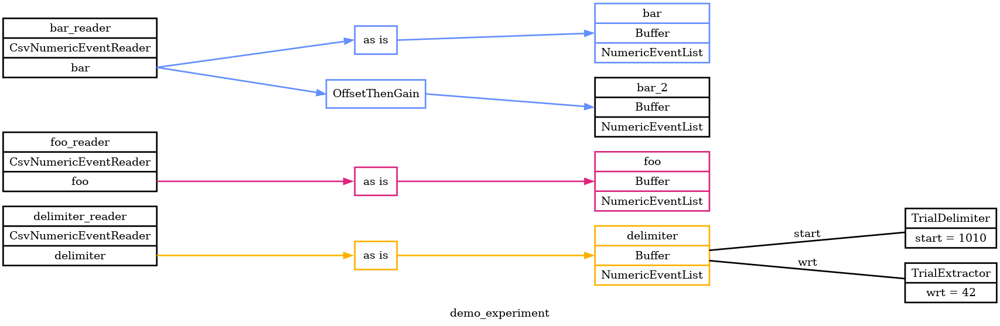

# Pyramid

This folder contains a Python project called Pyramid.
"Pyramid" is a pun on "Python" and "FIRA" (the Gold Lab's long-standing Matlab analysis tools).
Pyramid is intended as a successor to FIRA.

Pyramid reads data from various sources into a simple, shared data model called the Neutral Zone.
Based on event times in the Neutral Zone, it delimits Trials in time.
It populates each trial with data from various sources, configured by a YAML file.
It produces a JSON "trial file" with one big array of trials.

Pyramid can run online as an experiment happens or offline for later data analysis.
Either way, it views data as a sliding window over time.
This approach is helpful for dealing with live data as well as large data files.

Pyramid is a work in progress, but here's an overview of the vision.


# Demo / Example

Here's a demo / example of the core functionality so far.

## overview

This example will read event data from several CSV files.
Some of the events will be used to delimit trials in time and to align data within a trial.
Other events will be selected based on the delimited times and added to appropriate trials.
Pyramid will write each trial to a JSON "trial file", as it goes along.

The files used in this demo are located here in this repo at [gold-lab-nwb-conversions/pyramid/docs/core-demo](docs/core-demo).

## visualizing experiment configuration

Let's start by running Pyramid to generate an overview of a demo experiment.
After that we'll go back and look at each part in more detail.

If you haven't already, you'll need to [install Pyramid](#installation).
Then you can generate run the following:

```
cd gold-lab-nwb-conversions/pyramid/docs/core-demo
pyramid graph --experiment demo_experiment.yaml --graph-file demo_experiment.png
```

This will produce a graph of Pyramid data sources and other configuration.
Having a graph is useful for this demo.
In general, graphs like this should give you a way to check whether Pyramid interpreted your experiment the way you expected.

`demo_experiment.png`


From this graph, we can see that Pyramid intends to:

 - read event data from 3 different CSV files
 - deal events as they arrive into 4 different named buffers
 - transform event values on the way into one of those buffers
 - delimit trials based on events in buffer named "delimiter"
 - align data within each trial based on other events in the buffer named "delimiter"
 - add additional data to trials from buffers named "foo", "bar", and "bar_2"


## configuration with YAML

The [demo_experiment.yaml](docs/core-demo/demo_experiment.yaml) we graphed above is an example of a Pyramid experiment [YAML](https://en.wikipedia.org/wiki/YAML) file.
Each experiment design or rig setup would have its own YAML file to capture and declare how the experiment is set up, including things like:

 - basic descriptions of the experiment design and lab
 - which data sources to read into the Pyramid Neutral Zone
 - how to delimit and align trials based on the events as they arrive
 - how to interpret and transform raw data into meaningful concepts like:
   - the analog signal on a particular channel is "pupil diameter"
   - distict numeric events from a particular source should be grouped and converted into string-valued "matlab commands"

The main sections of each YAML file are:

 - `experiment` -- basic description of the experiment design and lab, suitable for including in an NWB file.
 - `readers` -- detailed description of data sources to read from, how to map and transform data from those sources into named buffers
 - `trials` -- how to delimit trials in time and align data within each trial based on events as they arrive
 - `plotters` -- optionally, how to visualize each trial as it arrives

## data sources

This demo experiment reads data from three CSV files.
CSV is a simple format, easy to get started with.
Going forward we expect to read data from other online and offline sources like Plexon, Open Ephys and NWB.

Since the CSVs in this demo are small, we can just look at them here and get a sense for what should happen when Pyramid runs.

### delimiter
[delimiter.csv](docs/core-demo/delimiter.csv) determines the structure of trials in time.

```
time,   value
1.0,    1010
1.5,    42
2.0,    1010
2.5,    42
2.6,    42
3.0,    1010
3.5,    42
```

Each row is interpreted as one event.  The first column has the event time stamp, the second column has a numeric event value.
The first header row is ignored.

For the demo experiment Pyramid will treat events with value `1010` as trial starts and ends.
It will treat events with value `42` as trial "with respect to" events for aligning data to a zero-time within each trial.

Based on the `1010` delimiting events, we'd expect the following trials:
 - trial 0 -- everything preceeding the first "start" at time `1.0`
 - trial 1 -- a trial between "start" events at times `1.0` and `2.0`
 - trial 2 -- a trial between "start" events at times `2.0` and `3.0`
 - trial 3 -- a last trial, everything after the last "start" at time `3.0`

Based on the `42` wrt events, each trial other than trial 0 would have its data aligned to a "zero" time half way through the trial.

### foo
[foo.csv](docs/core-demo/foo.csv) is an example of additional data to be added to a trial after the trial has been delimited above.  These show how data are assigned to trials based on the trial's time range, and how they can be aligned in time with respect to the wrt event in each trial.

```
time,   value
0.2,    0
1.2,    0
1.3,    1
2.2,    0
2.3,    1
```

Foo has events that arrive during trials 0, 1, and 2, but not trial 3.  It will turn out that these events arrive before the wrt events in trials 1 and 2, so they will have negative time stamps in those trials. 

### bar
[bar.csv](docs/core-demo/bar.csv) is another example of data to be added to each trial after it's delimited.

```
time,   value
0.1,    1
3.1,    0
```

Bar has events that arrive during trials 0 and 3, but not 1 or 2.  It will turn out that the event in trial 3 arrives before the wrt event in that trial, so it will end up with a negative time stamp.

The demo experiment will use data it reads from `bar.csv` twice!  This will demonstrate flexibility in how data can be read in, then mapped and transformed before being put into trials.

 - direct use: copy events directly into a buffer named "bar".
 - transformed use: copy events, apply a gain and offset to the event values, and put in a separate buffer named "bar_2"

## running a conversion

So far, we've looked at input data and Pyramid experiment configuration.
Now let's put those together and let Pyramid run through the data and convert events to trials.

```
cd gold-lab-nwb-conversions/pyramid/docs/core-demo

pyramid convert --experiment demo_experiment.yaml --readers delimiter_reader.csv_file=delimiter.csv foo_reader.csv_file=foo.csv bar_reader.csv_file=bar.csv --trial-file demo_trials.json
```

As above, this invokes Pyramid on our experiment YAML file.
Instead of `graph` mode, it uses `convert` mode to actually run through the data.

In addition, it specifies several CSV filenames for each reader to use.
We could have put those file names directly into the `demo_experiment.yaml` file, and that would work fine.
But maybe the specifc files to use need to change each experiment session.  Instead of having to edit the YAML each time, we can override specific reader args from the command line.

Finally, it specifies `demo_trials.json` as the output trial file to write.

### trial file

Let's look at the trial file to see if it matches our expectations from above.
For this demo the trial file is not very long, and it looks like this (mildly formatted here for clarity):

```
[
{"start_time": 0.0, "end_time": 1.0, "wrt_time": 0.0,
  "numeric_events": {"foo": [[0.2, 0.0]], "bar": [[0.1, 1.0]], "bar_2": [[0.1, -22.0]]}},
{"start_time": 1.0, "end_time": 2.0, "wrt_time": 1.5,
  "numeric_events": {"foo": [[-0.3, 0.0], [-0.2, 1.0]], "bar": [], "bar_2": []}},
{"start_time": 2.0, "end_time": 3.0, "wrt_time": 2.5,
  "numeric_events": {"foo": [[-0.3, 0.0], [-0.2, 1.0]], "bar": [], "bar_2": []}},
{"start_time": 3.0, "end_time": null, "wrt_time": 3.5,
  "numeric_events": {"foo": [], "bar": [[-0.4, 0.0]], "bar_2": [[-0.4, -20.0]]}}
]
```

Each trial found during the `convert` run is written to its own line in the trial file.
In addition, the whole trial file is a valid JSON array of trial objects.

We got 4 trials as expected, delimited by start and end times that fall on whole-numbered seconds.
Each trial has a wrt time that falls between the start and end.
Data from the "foo", "bar", and "bar_2" buffers are assigned to each trial based on start and end times, and then aligned to the wrt time.

## running with plotters

Pyramid `convert` mode probably makes sense when running conversions offline, when we want things to run as fast as the data will allow.

Pyramid also has a `gui` mode which probaly makes sense when running online, during live acquisition.
In `gui` mode Pyramid can manage figure windows and update data plots after each trial.

```
cd gold-lab-nwb-conversions/pyramid/docs/core-demo

pyramid gui --experiment demo_experiment.yaml --readers delimiter_reader.csv_file=delimiter.csv foo_reader.csv_file=foo.csv bar_reader.csv_file=bar.csv --trial-file demo_trials.json
```

This command is identical to the `convert` command above, except for the mode argument, which is now `gui`.

A figure window should open and update every few second as new trials arrive.
The plot in this example just shows basic trial extraction progress.
Custom plots can also be created, and configured in the `plotters` section of the experiment YAML.

### simulating delay

Why does `gui` mode run for several seconds, when the data are just sitting there in CSV files?
This is because Pyramid is simulating the delay between trial "start" event time stamps, as written `delimiter.csv`.
Delay simulation is optional for demo purposes and only happens if a reader's YAML contains `simulate_delay: True`.

## loading data in Matlab

Since the trial file is JSON, it should be readable in a variety of environments, not just Pyramid or Python.
Here's Matlab example for reading a trial file into a struct.

```
trial_file = 'demo_trials.json';
trial_json = fileread(trial_file, "Encoding", "UTF-8");
trials = jsondecode(trial_json)

trials = 

  4×1 struct array with fields:

    start_time
    end_time
    wrt_time
    numeric_events
```

For trial files small enough to load in to memory, this might be all we need!
For larger trial files, we might need custom Matlab code that read part of the data at a time.

# Installation

You should be able to install Pyramid on any machine -- you don't need a special machine like the lab's Neuropixels machine.

## conda
We've been using the `conda` tool to set up Python environments with the desired versions of Python and dependencies.
Here are instructions for [installing miniconda](https://docs.conda.io/projects/conda/en/latest/user-guide/install/index.html)

With that you can obtain this repo and set up our `gold_nwb` conda environment.

```
git clone https://github.com/benjamin-heasly/gold-lab-nwb-conversions
cd gold-lab-nwb-conversions
conda env create -f environment.yml
```

If you've already dones that in the past but you want to make sure you're up to date, you can update your conda environment.

```
cd gold-lab-nwb-conversions
git pull
conda env update -f environment.yml --prune
```

## pyramid

Now you can install Pyramid from this repo into the `gold_nwb` environment on your machine.

```
cd pyramid
conda activate gold_nwb
pip install .
pyramid --help
```

## dev tools

During development I'm also using [hatch](https://github.com/pypa/hatch) and [pytest](https://docs.pytest.org/en/7.1.x/getting-started.html)  to manage Pyramid as a Python project.  Most users won't need to use these.

I'm manually installing these into the `gold_nwb` environment on my machine.

```
conda activate gold_nwb
pipx install hatch
pip install pytest
```

I'm running the Pyramid unit and integration tests like this:

```
cd pyramid
hatch run test:cov
```

Hatch is smart enough to install pytest automatically in the tests environment it creates.
The reason I also install pytest manually is so that my IDE recognizes pytest for syntax highlighting, etc.
