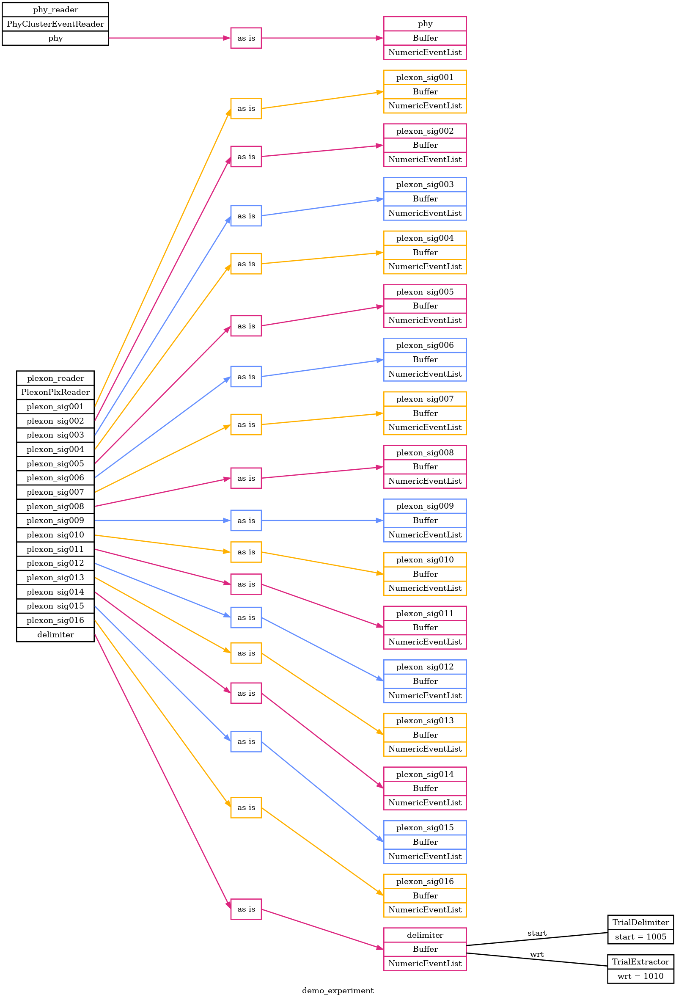

# Phy and Plexon Demo

Here's a demo / example of Pyramid with spike sorting output from [Phy](https://phy.readthedocs.io/en/latest/) along with original data from a Plexon `.plx` file.

## overview

This demo assumes some data files from the [Gold Lab](https://www.med.upenn.edu/goldlab/): a Plexon `.plx` file
and corresponding folder of sorting output from Phy.
The pipeline used to get from raw Plexon to sorted Phy output is not included here, and neither are the data files!
So, this demo is most relevant for members of the Gold Lab.

It might still be useful to others, as an example of how to configure Pyramid with Phy data.
This demo will refer to data at the following locations:

```
# Plexon
~/data/MrM/Raw/MM_2023_08_25B_Rec_V-ProRec.plx

# Phy params.py, plus other data files in the same folder
~/data/MrM/Kilosort/MM_2023_08_25B_Rec_V-ProRec/MM_2023_08_25B_Rec_V-ProRec/phy/params.py
```

Pyramid will read Plexon event data to partition the data into trials.
It will display both Plexon and Phy spike data in each trial.

### experiment configuration graph

To start with, we can generate an overview graph of the experiment configuration.  Don't forget to `cd` to this folder!

```
cd gold-lab-nwb-conversions/pyramid/docs/phy-plexon-demo

pyramid graph --graph-file images/demo_experiment.png --experiment demo_experiment.yaml --readers plexon_reader.plx_file=~/data/MrM/Raw/MM_2023_08_25B_Rec_V-ProRec.plx phy_reader.params_file=~/data/MrM/Kilosort/MM_2023_08_25B_Rec_V-ProRec/MM_2023_08_25B_Rec_V-ProRec/phy/params.py
```

`images/demo_experiment.png`


Note the `--search-path ./config` at the end of the command.
This lets Pyramid look in the nearby `./config` folder for files mentioned in `demo_experiment.yaml`, which helps us organize the demo.

The `--search-path` can point to any folder or list of folders on your machine, so it could help organize various shared and lab-specific code and config.
The default search path is in the user's home folder, `~/pyramd`.

## experiment YAML

The experiment YAML file [demo_experiment.yaml](demo_experiment.yaml) tells Pyramid how to read, process, and plot the data in our Plexon file.  Here are some highlights.

### readers: ###

The `readers:` section tells Pyramid to read a Plexon file, and which event, spike, and AD signal channels to take:

 - For `spikes` it will take `all` of the channels present in the file.
 - For `events` it will take only the `Strobed` channel and give it the name `ecodes`.  It will also make a separate copy the `ecodes` buffer, named `delimiter`.
 - For AD `signals` it will take only the channels named `X50` and `Y51` and give these the names `gaze_x` and `gaze_y`.  It will apply a gain of 10 to each signal to scale the voltage data into degrees visual angle.


```
readers:
```

### plotters: ###

The plotters section declares several plotters that Pyramid will show in figure windows and update as each trial arrives.
Descriptions and shots below!

```
plotters:
```

#### SpikeEventsPlotter
The [SpikeEventsPlotter](https://github.com/benjamin-heasly/gold-lab-nwb-conversions/blob/main/pyramid/src/pyramid/plotters/standard_plotters.py#L483) shows spike event times from all Plexon spike channels.  Spikes are grouped and color-coded by integer channel number and fractionally offset by unit number.  The most recent trial is in full color, on top of 10 recent trials which are partially transparent.


## running it

Here's how to run Pyramid in `gui` mode, which is how the plots shown above were created.

```
pyramid gui --trial-file demo_experiment.hdf5 --experiment demo_experiment.yaml --readers plexon_reader.plx_file=~/data/MrM/Raw/MM_2023_08_25B_Rec_V-ProRec.plx phy_reader.params_file=~/data/MrM/Kilosort/MM_2023_08_25B_Rec_V-ProRec/MM_2023_08_25B_Rec_V-ProRec/phy/params.py
```

This should open up a few figure windows, similar to the images above.
The plots should update every few seconds, as if replaying the original acquisition timeline (in `gui` mode Pyramid can simulate delay while reading from data files.)

To exit Pyramid, you can:
 - wait a long time for the replay to finish
 - close all the figure windows
 - `ctrl-c` or `kill` the Pyramid process
 - press the `Quit` button in the `BasicInfoPlotter`
