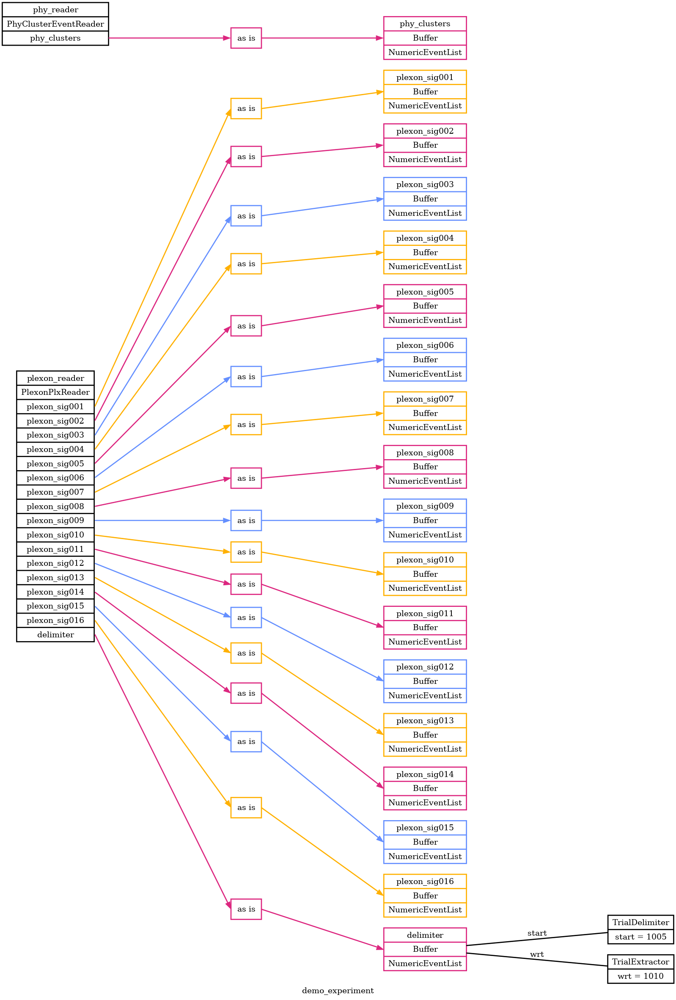
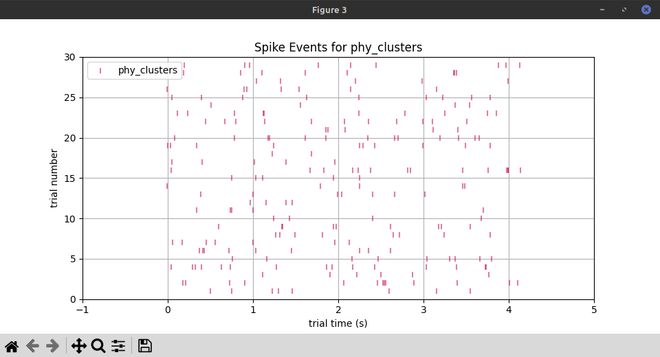

# Phy and Plexon Demo

Here's a demo / example of Pyramid with spike sorting output from [Phy](https://phy.readthedocs.io/en/latest/) along with original data from a Plexon `.plx` file.

## overview

This demo assumes some data files from the [Gold Lab](https://www.med.upenn.edu/goldlab/):

 - a Plexon `.plx` file
 - a corresponding folder of sorting output from Phy

The pipeline used to get from raw Plexon to sorted Phy output is not included here, and neither are the data files!
So, this demo is most relevant for members of the Gold Lab.

This might still be useful to others, as an example of how to configure Pyramid with Phy data.
This demo will refer to data at the following locations, which you should change for your own setup:

```
# Plexon
~/data/MrM/Raw/MM_2023_08_25B_Rec_V-ProRec.plx

# Phy params.py (plus other data files in the same folder)
~/data/MrM/Kilosort/MM_2023_08_25B_Rec_V-ProRec/MM_2023_08_25B_Rec_V-ProRec/phy/params.py
```

Pyramid will read Plexon event data to partition the timeline into trials.
It will display both Plexon and Phy spike data for each trial.

### experiment configuration graph

To start with, we can generate an overview graph of the experiment configuration.  Don't forget to `cd` to this folder!

```
cd gold-lab-nwb-conversions/pyramid/docs/phy-plexon-demo

pyramid graph --graph-file images/demo_experiment.png --experiment demo_experiment.yaml --readers plexon_reader.plx_file=~/data/MrM/Raw/MM_2023_08_25B_Rec_V-ProRec.plx phy_reader.params_file=~/data/MrM/Kilosort/MM_2023_08_25B_Rec_V-ProRec/MM_2023_08_25B_Rec_V-ProRec/phy/params.py
```

`images/demo_experiment.png`


## experiment YAML

The experiment YAML file [demo_experiment.yaml](demo_experiment.yaml) tells Pyramid how to read, process, and plot the data in our Phy an Plexon files.  Here are some highlights.

### readers: ###

The `readers:` section tells Pyramid to read a Plexon file, and which events and spikes to keep:

 - For `spikes` it will take `all` of the channels present in the file.  Each spike channel will go to its own Pyramid buffer, automatically named with a `plexon_` prefix.
 - For `events` it will take only the `Strobed` channel and give it the name `delimiter`.
 - It won't keep any AD signal channels.

```
readers:
  plexon_reader:
    class: pyramid.neutral_zone.readers.plexon.PlexonPlxReader
    args:
      # Override plx_file on cli with: --readers plexon_reader.plx_file=my_real_file.plx
      plx_file: my_file.plx
      signals: {}
      spikes: all
      spikes_prefix: plexon_
      events:
        Strobed: delimiter
    # For gui demo, wait between trial delimiting events.
    simulate_delay: True
  phy_reader:
    class: pyramid.neutral_zone.readers.phy.PhyClusterEventReader
    args:
      # Override params_file on cli with: --readers phy_reader.params_file=my_real_params.py
      params_file: my_params.py
      result_name: phy_clusters
      cluster_filter: KSLabel=='good'
```

The `readers:` section also tells Pyramid to read a folder of Phy files and to put those spike events into a Pyramid buffer named `phy_clusters`.
Futhermore, it tells Pyramid to filter the clusters and only keep those that have a `KSLabel` property equal to `'good'`.

Pyramid supports cluster filtering by reading Phy's `cluster_*` CSV or TSV files, and building up a dictionary of info about each cluster.
The CSV or TSV column headers become local variables, accessible to Python string expressions passed to the Phy reader as its `cluster_filter` arg.
Pyramid will only keep clusters for which the given `cluster_filter` evaluates to `True` or [truthy](https://docs.python.org/3/library/stdtypes.html#truth-value-testing).

In this example, with `cluster_filter` given as `KSLabel=='good'`, Pyramid will only keep Phy clusters that have the value `good` in the `KSLabel` column.
This is intented to align well with the Phy [Cluster view](https://phy.readthedocs.io/en/latest/visualization/).

### plotters: ###

The plotters section declares a few plotters that Pyramid will show in figure windows and update as each trial arrives.

```
plotters:
    # Plot basic info about conversion process, plus a "Quit" button.
  - class: pyramid.plotters.standard_plotters.BasicInfoPlotter
    # Plot Plexon spike events as raster with trials on the y-axis.
    # Plexon spike events have two values (following the timestamp): [channel, unit].
    # "value_index: 1" and "value_selection: 1" mean index to the unit column and select only where unit==1.
    # This way, we only plot spikes that have been sorted to unit 1.
  - class: pyramid.plotters.standard_plotters.SpikeEventsPlotter
    args:
      xmin: -1.0
      xmax: 5.0
      match_pattern: plexon_sig.*
      value_index: 1
      value_selection: 1
    # Plot Phy spike events as raster with trials on the y-axis.
    # Phy spike events have one value (following the timestamp): [cluster_id].
    # For now, we just plot them all.
  - class: pyramid.plotters.standard_plotters.SpikeEventsPlotter
    args:
      xmin: -1.0
      xmax: 5.0
      match_pattern: phy_clusters
```

The first plot, a [BasicInfoPlotter](https://github.com/benjamin-heasly/gold-lab-nwb-conversions/blob/main/pyramid/src/pyramid/plotters/standard_plotters.py#L35), shows Pyramid's overall progress parsing trials, and has a Quit button.

Two [SpikeEventPlotter](https://github.com/benjamin-heasly/gold-lab-nwb-conversions/blob/main/pyramid/src/pyramid/plotters/standard_plotters.py#L486)s show spikes as rasters, with the trial number on the vertical axis.

The first SpikeEventPlotter shows Plexon spikes from all channels.  Only spikes assigned to Plexon unit 1 are shown.  The plexon channels are color-coded in the legend.


The second SpikeEventPlotter shows spikes from Phy.  All clusters are shown together.



So far, the Plexon and Phy spike events don't seem to correspond.
This might just be a bad choice of sample data.
It would be cool to find a nicer-looking example!

## running it

Here's how to run Pyramid in `gui` mode, which is how the plots shown above were created.

```
pyramid gui --trial-file demo_experiment.hdf5 --experiment demo_experiment.yaml --readers plexon_reader.plx_file=~/data/MrM/Raw/MM_2023_08_25B_Rec_V-ProRec.plx phy_reader.params_file=~/data/MrM/Kilosort/MM_2023_08_25B_Rec_V-ProRec/MM_2023_08_25B_Rec_V-ProRec/phy/params.py
```

This should open up a few figure windows, similar to the images above.
The plots should update every few seconds, as if replaying the original acquisition timeline (in `gui` mode Pyramid can simulate delay while reading from data files.)

To exit Pyramid, you can:
 - wait a long time for the replay to finish
 - close all the figure windows
 - `ctrl-c` or `kill` the Pyramid process
 - press the `Quit` button in the `BasicInfoPlotter`
