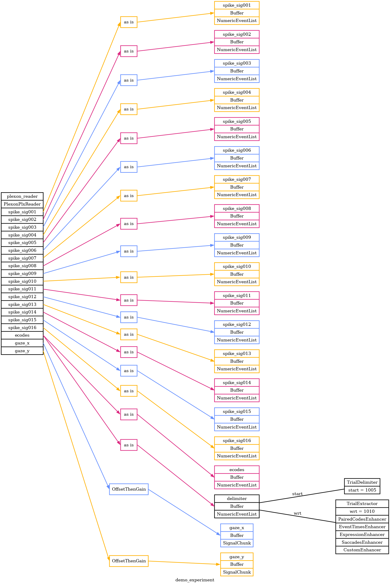

# Signals Demo

Here's a demo / example of Pyramid with a Plexon .plx file.

## overview

This example will read from a Plexon .plx file on your machine.
Since .plx files can be large, you'll have to bring your own.
Note the path of the file you want to use, for example,

```
/home/ninjaben/Desktop/codin/gold-lab/plexon_data/MrM/Raw/MM_2022_08_05_REC.plx
```

Pyramid will read several event, spike event, and analog signal channels from the file.
By default it will read all of them, though this can be configured in the [demo_experiment.yaml](demo_experiment.yaml) (TODO).
It will delimit trials based on the "Strobed" event channel, using value 1005 to delimit trials and 1010 as the trial wrt event.
These values are also configurable in the YAML.


## visualizing experiment configuration

Let's start by running Pyramid to generate an overview.

```
cd gold-lab-nwb-conversions/pyramid/docs/plexon-demo

pyramid graph --graph-file demo_experiment.png --experiment demo_experiment.yaml --readers plexon_reader.plx_file=/home/ninjaben/Desktop/codin/gold-lab/plexon_data/MrM/Raw/MM_2022_08_05_REC.plx
```

This will produce a graph of Pyramid data sources and other configuration.

`demo_experiment.png`


This reflects much of the config set up in [demo_experiment.yaml](demo_experiment.yaml), which is the source of truth for this demo.

## running with plotters

We can run this demo experiment in `gui` mode to view the trials, events, and signals from the Plexon file.

```
cd gold-lab-nwb-conversions/pyramid/docs/plexon-demo

pyramid gui --trial-file demo_experiment.json --experiment demo_experiment.yaml --readers plexon_reader.plx_file=/home/ninjaben/Desktop/codin/gold-lab/plexon_data/MrM/Raw/MM_2022_08_05_REC.plx
```

This will open up a few figure windows.  You might want to arrange them.
One figure will contain basic info about the experiment, demo subject, and trial extraction progress.
The other figures will show trial-by-trial event and signal data.

The trials will update every few seconds, as if replaying the original acquisition timeline (in `gui` mode Pyramid can simulate delay while reading from data files.)
