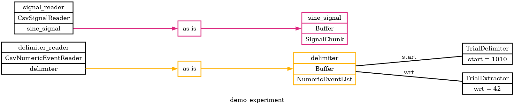
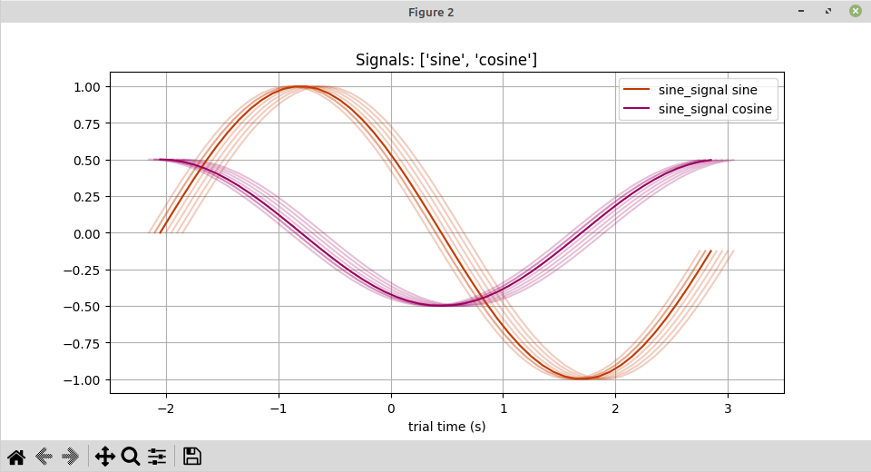
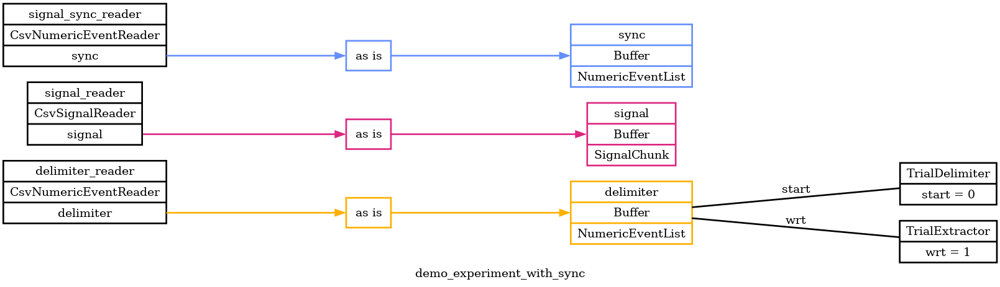

# Signals Demo

Here's a demo / example of Pyramid signal chunks and plotting, and alignment.

## overview

First, the example will read from two CSV files:

 - [delimiter.csv](delimiter.csv), will partition about a minute of time into 10 trials.
 - [signal.csv](signal.csv) contains many samples of the sine and cosine functions, over that time.

Pyramid will read in the delimiter events and signal data, partition them into trials, and plot signal chunks for each trial.  The signal chunks will stack up near each other, from trial to trial.

Next, the example will introduce a third CSV file that contains clock sync events.
These will be used to correct trial-to-trial timing drift in the signal data.

 - [signal_sync.csv](signal_sync.csv) contains .

## visualizing experiment configuration

Let's start with a graphical overview of this demo experiment.

```
cd gold-lab-nwb-conversions/pyramid/docs/signal-demo

pyramid graph --graph-file demo_experiment.png --experiment demo_experiment.yaml
```

`demo_experiment.png`


This reflects much of the config set up in [demo_experiment.yaml](demo_experiment.yaml), which is the source of truth for this demo.  Pyramid will read delimiting events from one CSV file, and signal data from another CSV file.

## running with plotters

We can run this demo experiment in `gui` mode to view the signals.

```
pyramid gui --trial-file demo_trials.json --experiment demo_experiment.yaml
```

This will open up two figure windows.  You might want to arrange them.
One figure will contain basic info about the experiment, demo subject, and trial extraction progress.
The other figure will show signal chunks assigned to each trial.




The trials will update every few seconds as trials occur (in `gui` mode Pyramid can simulate delay while reading from data files.)

## sync WIP

```
pyramid graph --graph-file demo_experiment_with_sync.png --experiment demo_experiment_with_sync.yaml
```

`demo_experiment_with_sync.png`


```
pyramid gui --trial-file demo_trials_with_sync.json --experiment demo_experiment_with_sync.yaml
```


## Wut?

The reference clock is ticking off trials every pi seconds, from its point of view.
This is also the period of a true sinusoid.
So, the reference clock is already aligned to the true sinusoid.
The reference clock also ticks off events every quarter-phase pi/2 seconds, for convenience.

The signal clock ticks slower than the reference clock, 0.95 signal-seconds per reference-second.
The signal clock is used to sample the true sinusoid.
Naively, without realignment, the sinusoid pattern would appear to drift relative to the reference clock.
However, we have also used the signal clock to mark the peaks on the sinusoid.
So, we can see the same true peak events from both clocks.
Using the difference in event times between the clocks, we can realign the sinusoids per trial.
We only realign -- we don't resample.
So the farther we get from the peaks, the more drift creeps back in.
We are assuming this drift would be small within the time span of each trial.

With the signal data shifted each trial, the sinusoid no longer drifts over time.
Since we used the sinusoid peak to align trials as well as clocks, the peak always occurs right at zero.
Since we're not stretching or resampling the data, the period of the sinusoid is still wrong by a factor of 0.95.
The sinusoid patterns still overlay exactly with each other because the clock drift in this example is constant.
The edges of the sinusoid patterns are ragged because:
 - for each trial we grab a chunk of data that matches the trial duration (no stretching means same duration by both clocks)
 - then we align the chunk of data to some event in the middle
 - the edges are forced to move, to accommodate the middle
In addition:
 - the signal chunk in this example is low-frequency and the data chunk is rounded "in" to whole samples
 - whereas, event times are not constrained to any particular granularity
 - so events and signals may wiggle on the scale of sample frequency
 - the drift estimate used when querying a chunk of data is the one from last trial
 - the drift estimate used when shifting a chunk of data is the one from this trial
 - this may affect exactly where the edges are ragged, but not the fact that ragged edges must exist
